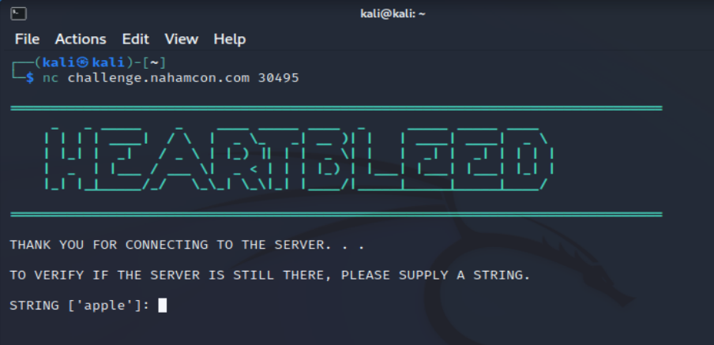
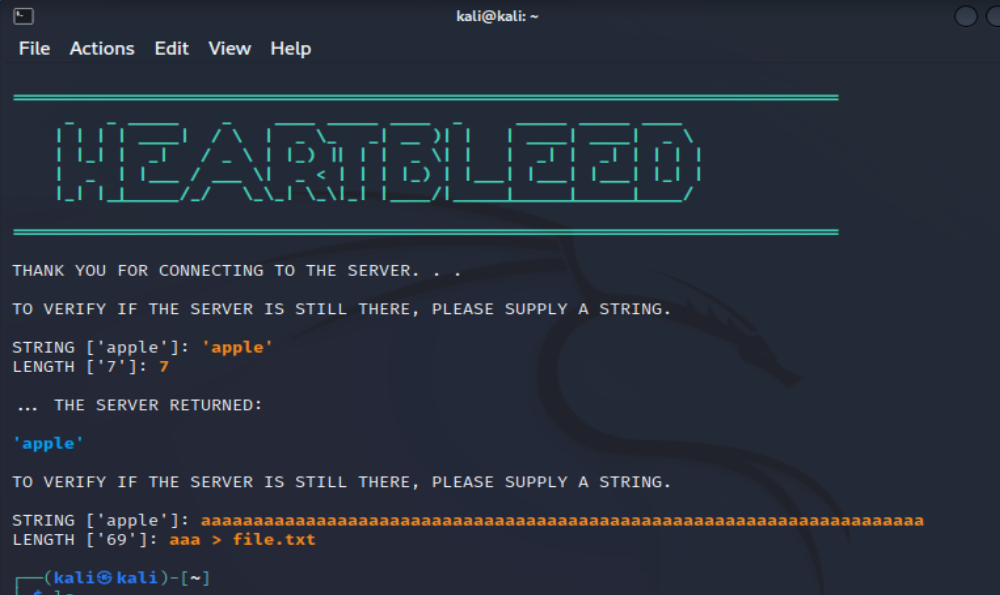
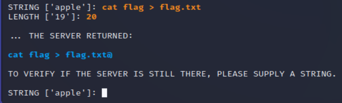
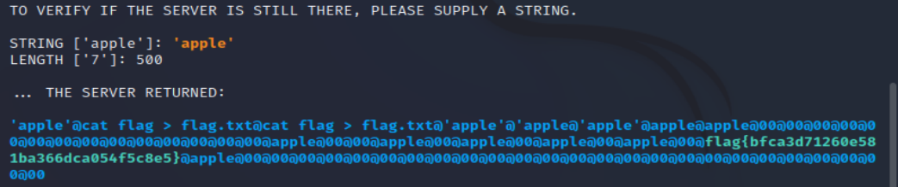

# Baby's First Heartbleed

<small>Author: @JohnHammond#6971</small>  Hey kids!! Wanna learn how to hack??!?! Start here to foster your curiosity!    <b>Press the <code>Start</code> button on the top-right to begin this challenge.</b>

## Solution 

After connecting with Netcat got the following screen:

To start with I followed the example by entering `'apple'` and `7`. 
Next, I tried a longer string to see how the program would handle it. 
`aaaaaaaaaaaaaaaaaaaaaaaaaaaaaaaaaaaaaaaaaaaaaaaaaaaaaaaaaaaaaaaaaaaaa`
On the length section, I tried to see if it was possible to send the results to a file, but the program exited.  

Tried `cat flag > flag.txt` by giving a length of 19 and instead I typed in 20 with an interesting result with a trailing @. 

Let's see what happens with a much larger number like 500. Found the flag of `flag{bfca3d71260e581ba366dca054f5c8e5}`. 

