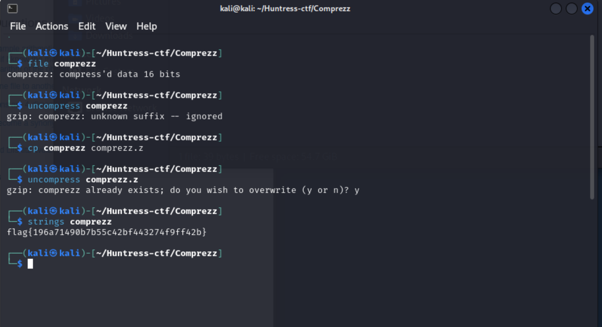

# Comprezz - Warmups - easy

Author: @JohnHammond

Someone stole my S's and replaced them with Z's! Have you ever seen this kind of file before?

Download the file(s) below.

## Solution
Started by running the `file` command to identify the type of file, and it showed `compress'd data 16 bits`.

A quick Google search revealed that this is a .Z file, which uses an old compression format.

After uncompressing the file, I found the flag `flag{196a71490b7b55c42bf443274f9ff42b}`

