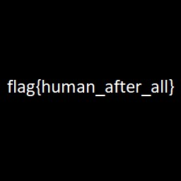

# Opposable Thumbs - Forensics - easy
Author: @JohnHammond

We uncovered a database. Perhaps the flag is right between your fingertips!

NOTE: this flag does NOT follow the standard MD5 hash format, but does have the usual flag{} prefix and suffix.

Download the file(s) below [3fa8aafdd63e1168.jpg](3fa8aafdd63e1168.jpg)

## Solution 
Used thumbcache_viewer_64 to extract and find the flag  
