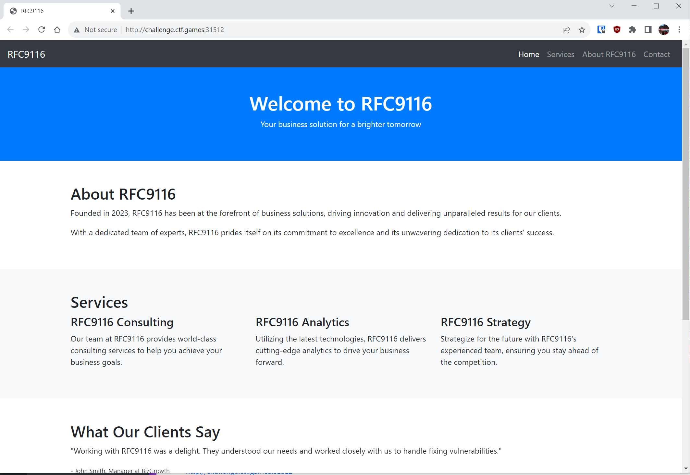
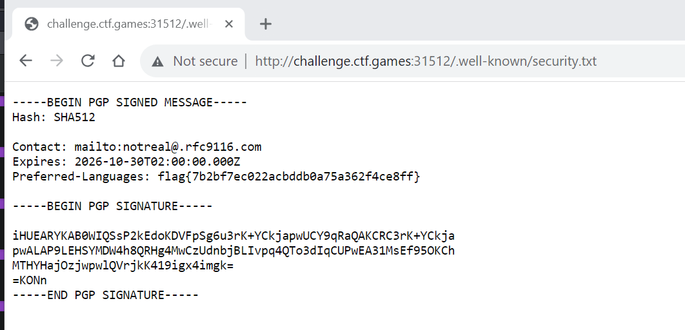

# Nine-One-Sixteen - Warmups - easy - points 50

 <small>Author: @JohnHammond</small>  We found a vulnerability in this company's software and we are trying to do  responsible disclosure! We want to notify the organization and contact them about the security issues... can you track down their contact info?    <b>Press the <code>Start</code> button in the top-right to begin this challenge.

Opened the website.

Quick google search on RFC 9116. Taking `/.well-known/security.txt` as a suggested path to try.

`flag{7b2bf7ec022acbddb0a75a362f4ce8ff}`