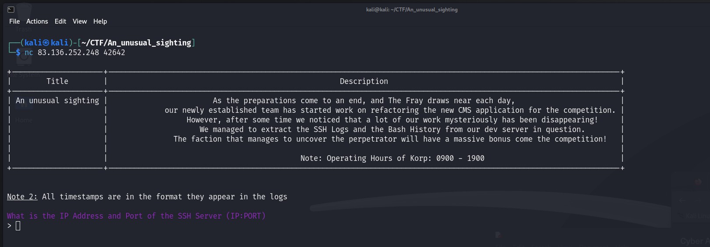
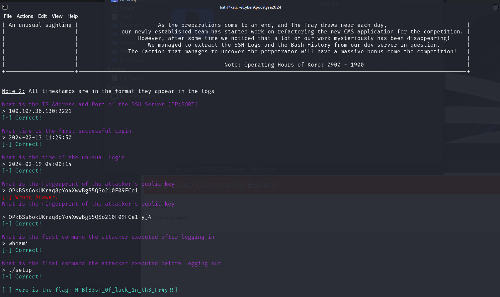

# An unusual sighting - Forensics - very easy 

As the preparations come to an end, and The Fray draws near each day, our newly established team has started work on refactoring the new CMS application for the competition. However, after some time we noticed that a lot of our work mysteriously has been disappearing! We managed to extract the SSH Logs and the Bash History from our dev server in question. The faction that manages to uncover the perpetrator will have a massive bonus come competition!

## Solution 

Upon connecting using NC, we were prompted to answer questions about the files.

Question 1: "What is the IP Address and Port of the SSH Server(IP:PORT)"  
Answer: `100.107.36.130:2221`  
Found in the sshd.log entry From reviwing the sshd.log file found this log entery `[2024-01-28 15:24:23] Connection from 100.72.1.95 port 47721 on 100.107.36.130 port 2221 rdomain ""`   

Question 2: What time is the first successful Login?  
Answer: `2024-02-13 11:29:50`  
Found in the ssdh.log entry `[2024-02-13 11:29:50] Accepted password for root from 100.81.51.199 port 63172 ssh2`  
  
  
Question 3: Time of unusal login?  
Answer: `2024-02-19 04:00:14`  
Noticed as an unusual login time, considering the operating hours of 0900 - 1900  

Question 4: What is the fingerprint of the attacker's public key?  
Answer: `OPkBSs6okUKraq8pYo4XwwBg55QSo210F09FCe1-yj4`  

Question 5: What is the first command the attacker executed ater logging in   
Answer: `whoami`  

Question 6: What is the final command the attacker executed before logging out  
Answer: `./setup`  

To obtain the flag `HTB{B3sT_0f_luck_1n_th3_Fr4y!!}`

