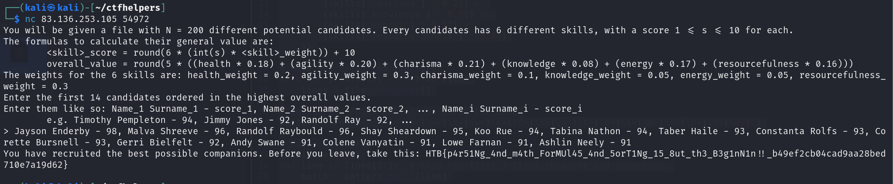

# Computational Recruiting

**Creator:** makelaris

**Description:** Not too long ago, your cyborg detective friend John Love told you he heard some strange rumours from some folks in the Establishment that he's searching into. They talked about the possible discovery of a new vault, vault 79, which might hold a big reserve of gold. Hearing of these news, youband your fellow compatriots slowly realized that with that gold reserver you could accomplish your dreams of reviving the currency of old times, and help modern civilization flourish once more. Looking at the potential location of the vault however, you begin to understand that this will be no easy task. Your team by itself is not enough. You will need some new recruitments. Now, standing in the center of Gigatron, talking and inspiring potential recruits, you have collected a big list of candidates based on skills you believe are needed for this quest. How can you decide however which ones are truly worthy of joining you?

**Category:** Coding

**Difficulty:** very easy

**File:** [data.txt](data.txt)

## Solution


This challenge involved connecting over Netcat (NC). 
```
You will be given a file with N = 200 different potential candidates. Every candidates has 6 different skills, with a score 1 <= s <= 10 for each.
The formulas to calculate their general value are:
        <skill>_score = round(6 * (int(s) * <skill>_weight)) + 10
        overall_value = round(5 * ((health * 0.18) + (agility * 0.20) + (charisma * 0.21) + (knowledge * 0.08) + (energy * 0.17) + (resourcefulness * 0.16)))
The weights for the 6 skills are: health_weight = 0.2, agility_weight = 0.3, charisma_weight = 0.1, knowledge_weight = 0.05, energy_weight = 0.05, resourcefulness_weight = 0.3
Enter the first 14 candidates ordered in the highest overall values.
Enter them like so: Name_1 Surname_1 - score_1, Name_2 Surname_2 - score_2, ..., Name_i Surname_i - score_i
        e.g. Timothy Pempleton - 94, Jimmy Jones - 92, Randolf Ray - 92, ...

```

I created a Python script, [solve.py](solve.py), which returned the following names:

```
Jayson Enderby - 98, Malva Shreeve - 96, Randolf Raybould - 96, Shay Sheardown - 95, Koo Rue - 94, Tabina Nathon - 94, Taber Haile - 93, Constanta Rolfs - 93, Corette Bursnell - 93, Gerri Bielfelt - 92, Andy Swane - 91, Colene Vanyatin - 91, Lowe Farnan - 91, Ashlin Neely - 91
```

This resulted in the flag:  `HTB{p4r51Ng_4nd_m4th_ForMUl45_4nd_5orT1Ng_15_8ut_th3_B3g1nN1n!!_b49ef2cb04cad9aa28bed710e7a19d62}`


