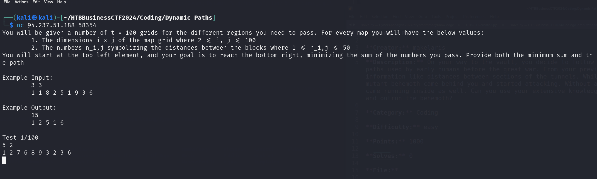

# Dynamic Paths

**Creator:** makelaris

**Description:** On your way to the vault, you decide to follow the underground tunnels, a vast and complicated network of paths used by early humans before the great war. From your previous hack, you already have a map of the tunnels, along with information like distances between sections of the tunnels. While you were studying it to figure your path, a wild super mutant behemoth came behind you and started attacking. Without a second thought, you run into the tunnel, but the behemoth came running inside as well. Can you use your extensive knowledge of the underground tunnels to reach your destination fast and outrun the behemoth?

**Category:** Coding

**Difficulty:** easy

## Solution

This challenge involved connecting over Netcat (NC). 
```
You will be given a number of t = 100 grids for the different regions you need to pass. For every map you will have the below values:
        1. The dimensions i x j of the map grid where 2 <= i, j <= 100
        2. The numbers n_i,j symbolizing the distances between the blocks where 1 <= n_i,j <= 50
You will start at the top left element, and your goal is to reach the bottom right, minimizing the sum of the numbers you pass. Provide both the minimum sum and the path

Example Input:
        3 3
        1 1 8 2 5 1 9 3 6

Example Output:
        15
        1 2 5 1 6

Test 1/100
5 2
1 2 7 6 8 9 3 2 3 6 

```



I created the following Python script:

```python
import socket

def min_sum(grid):
    m, n = len(grid), len(grid[0])
    dp = [[0] * n for _ in range(m)]

    # Initialize the first row and column
    dp[0][0] = grid[0][0]
    for i in range(1, m):
        dp[i][0] = dp[i-1][0] + grid[i][0]
    for j in range(1, n):
        dp[0][j] = dp[0][j-1] + grid[0][j]

    # Fill the rest of the dp table
    for i in range(1, m):
        for j in range(1, n):
            dp[i][j] = min(dp[i-1][j], dp[i][j-1]) + grid[i][j]

    return dp[m-1][n-1]

def min_sum_path(grid):
    rows = len(grid)
    cols = len(grid[0])
    
    # Initialize a memoization table to store the minimum sum for each cell
    memo = [[0] * cols for _ in range(rows)]
    
    # Fill the first row and first column of the memoization table
    memo[0][0] = grid[0][0]
    for i in range(1, rows):
        memo[i][0] = memo[i-1][0] + grid[i][0]
    for j in range(1, cols):
        memo[0][j] = memo[0][j-1] + grid[0][j]
    
    # Fill the rest of the memoization table
    for i in range(1, rows):
        for j in range(1, cols):
            memo[i][j] = grid[i][j] + min(memo[i-1][j], memo[i][j-1])
    
    # Backtrack to find the minimum sum path
    path = []
    i, j = rows-1, cols-1
    while i > 0 or j > 0:
        path.append(grid[i][j])
        if i == 0:
            j -= 1
        elif j == 0:
            i -= 1
        elif memo[i-1][j] < memo[i][j-1]:
            i -= 1
        else:
            j -= 1
    path.append(grid[0][0])
    
    return memo[rows-1][cols-1], path[::-1]

# Connect to the server
host = '83.136.255.141'
port = 31664

with socket.socket(socket.AF_INET, socket.SOCK_STREAM) as s:
    s.connect((host, port))
    full_message = ""
    runcount = 1
    while True:
        data = s.recv(2048).decode()
        print(data)

        full_message += data


        if not data:
            print("here brak")
            break
        if ">" in full_message:
            print("are we here")

            start_index = full_message.find(f"Test {runcount}/100")
            end_index = full_message.find(">", start_index)

            extracted_info = full_message[start_index:end_index].strip()
            #print("next is extracted_info")
            #print(extracted_info)

            lines = extracted_info.split('\n')
            #print(f"lines: {lines}")

            dimensions = lines[1].split()
            #print(f"dimensions: {dimensions}")

            rows, cols = map(int, dimensions)

            values = lines[2].split()

            grid_values = [int(value) for value  in values]

            grid = [grid_values[i:i+cols] for i in range(0, len(grid_values), cols)]

            min_sum, min_path = min_sum_path(grid)

            print(f"The Max Sum is: {min_sum}")
            s.sendall(str(min_sum).encode() + b'\n' )
            full_message = ""
            runcount += 1

```

That resulted in the flag of `HTB{b3h3M07H_5h0uld_H4v3_57ud13D_dYM4m1C_pr09r4mm1n9_70_C47ch_y0u_0a0e225fbade660e53cb4adf091d1409}`