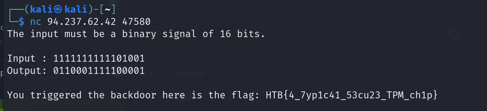

# It's Oops PM

**Creator:** makelaris

**Description:** With the location of the underground bunker secured, the crew embarks on the next phase of their plan: assessing the feasibility of creating an underground tunnel to bypass the super mutant camp. They secure samples of water, soil, and air near the area. Scouring the wasteland for salvageable equipment, they stumble upon a dilapidated research facility where they find a cache of environmental sensors. Examining these sensors, the crew discovers they communicate with a satellite and contain a crypto-processor that encrypts their transmissions. After hand-drawing the diagrams and emulating the silicon chip's logic with VHDL, they uncover what appears to be a backdoor in the embedded logic that only triggers when a specific input is given to the system. Determined to exploit this, they turn to their tech specialist. Can you connect to the satellite and activate it?

**Category:** Hardware

**Difficulty:** very easy

**File:** [hardware_its_oops_pm.zip](hardware_its_oops_pm.zip)

## Solution 

Upon examining the `backdoor.vhdl` file, I found a section of code that contained the backdoor pattern of `1111111111101001`.
```vhdl
architecture Behavioral of backdoor is
    constant pattern : STD_LOGIC_VECTOR(15 downto 0) := "1111111111101001";
begin
	process(D)
	begin
        if D = pattern then
            B <= '1';
        else
            B <= '0';
        end if;
	end process;
end Behavioral;
```

I used this pattern to find the flag: `HTB{4_7yp1c41_53cu23_TPM_ch1p}`.
