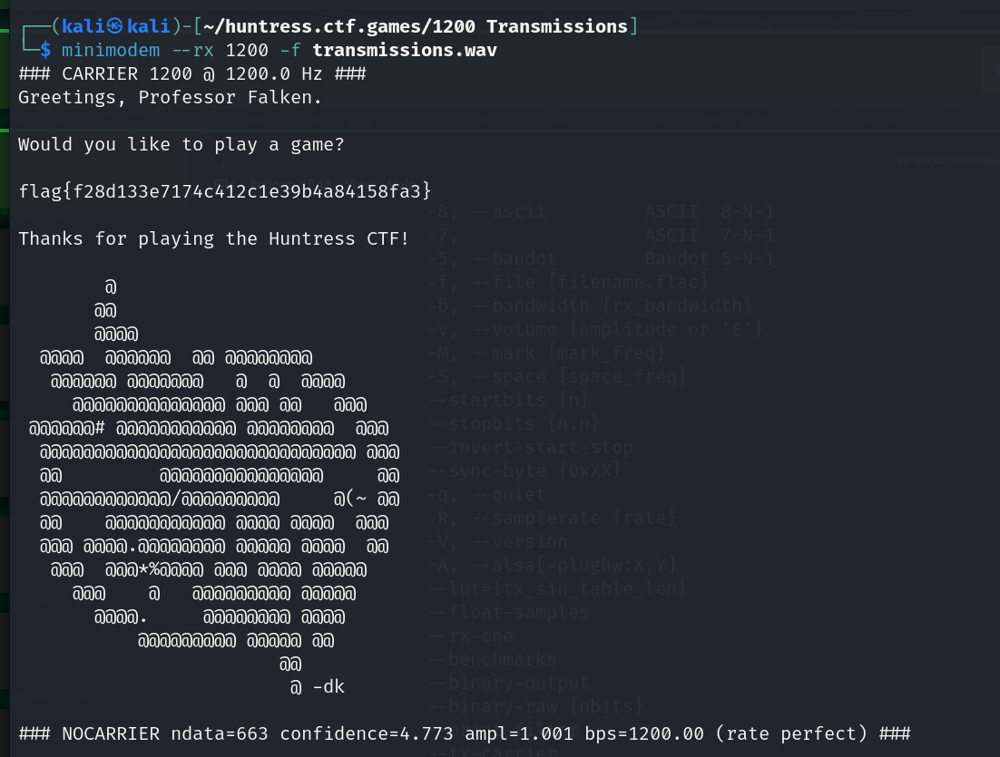

# 1200 Transmissions

**Description:**

<small>Author: @daveAThuntress</small>  Wait, there aren't actually 1200 transmissions in this file, are there?    <b> WARNING: The audio in this file is very loud and obnoxious. Please turn your volume way down before playing. </b>    <b>Download the file(s) below.</b>

**Category:** Miscellaneous

**Difficulty:** easy

**File:** [transmissions.wav](transmissions.wav)

## Solution

Started off I tried to decode the transmission in the audio file, I initially tried using DTMF (Dual-Tone Multi-Frequency) decoders. However, this approach only yielded a result of DD. 

I found Minimodem https://github.com/kamalmostafa/minimodem, a tool designed for decoding various audio modulations, which successfully decoded the full message and revealed the flag of `flag{f28d133e7174c412c1e39b4a84158fa3}`  

