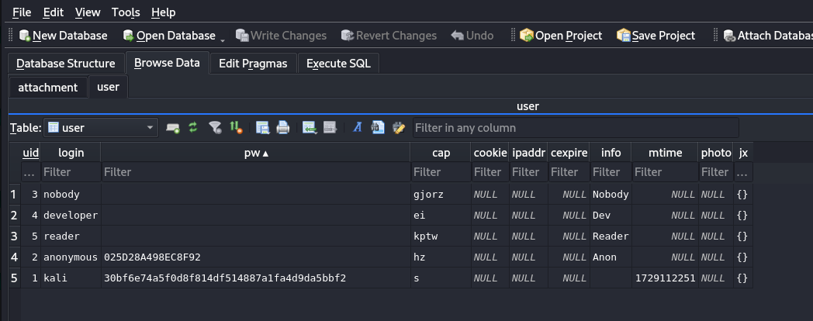

# Ancient Fossil

**Description:**

<small>Author: @JohnHammond</small><br><br>All things are lost to time... <br><br> <b>Download the file(s) below.</b><br>


**Category:** Forensics

**Difficulty:** easy

**File:** [ancient.fossil](ancient.fossil)

## Solution

I started by running the file command to determine the file type `file ancient.fossil` that gave the output of:
```
SQLite 3.x database (Fossil repository), last written using SQLite version 3046000, file counter 415, database pages 154, cookie 0x28, schema 4, UTF-8, version-valid-for 415

```

This revealed that the file is a Fossil repository stored in an SQLite database format.

Initially, I went down the path of treating it solely as an SQLite database, but after limited success, I revisited the fact that it’s specifically a Fossil repository, which meant Fossil version control commands might work better.




After some experimentation with different commands, I found that fossil export could provide the repository's change history: `fossil export -R ancient.fossil` 

To quickly locate the flag, I used grep to search for any lines containing "flag": `fossil export -R ancient.fossil | grep 'flag'`

Flag of `flag{2ed33f365669ea9f10b1a4ea4566fe8c}`
