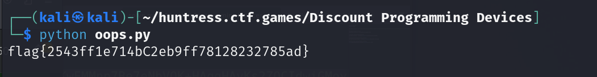

# Discount Programming Devices

**Description:**

<small>Author: @sudo_Rem</small>  I used a tool on the internet to obfuscate my script!  But I lost it, and I don't know how to get it back.   Maybe you can help?     <b>Download the file(s) below.</b>

**Category:** Malware

**Difficulty:** easy

**File:** [oops.py](oops.py)

## Solution

Ran the file to get the flag `flag{2543ff1e714bC2eb9ff78128232785ad}`  
