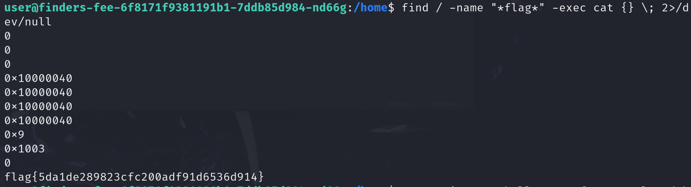

# Finders Fee

**Description:**

<small>Author: @JohnHammond</small>  You gotta make sure the people who find stuff for you are rewarded well!    <b>Escalate your privileges and uncover the <code>flag.txt</code> in the <code>finder</code> user's home directory.</b>
    <b>Press the <code>Start</code> button in the top-right to begin this challenge.

**Category:** Warmups

**Difficulty:** easy

## Solution

 I used the find command to search the file system for any files containing "flag" in the name. Redirecting errors to /dev/null suppressed permission errors `find / -name "*flag*" 2>/dev/null`

This command located the flag.txt file, indicating that it existed somewhere on the system but that I didn’t yet have the permissions to read it directly. 

Since find could locate the flag file, it suggested that `find` might have elevated permissions. This could be exploited to access files normally restricted to my user.  I used `find` command to search for and read the contents of flag.txt in one step: `sudo find / -name "*flag*" -exec cat {} \; 2>/dev/null`

