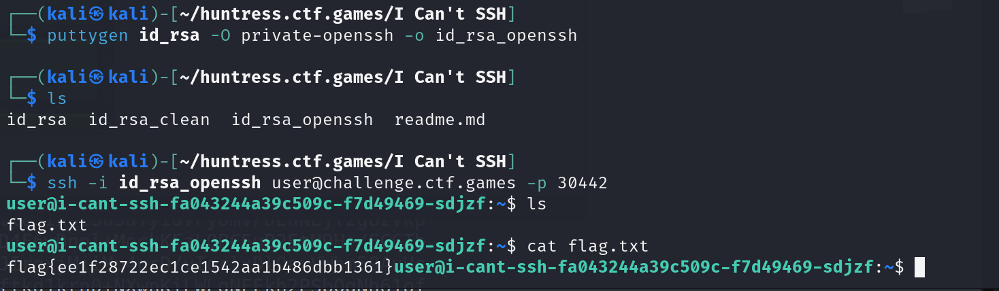

# I Can't SSH

**Description:**

<small>Author: @JohnHammond</small>  I've got this private key... but why can't I SSH?    <b>Download the file(s) below and press <code>Start</code> on the top-right to begin this challenge.</b>

**Category:** Warmups

**Difficulty:** easy

**File:** [id_rsa](id_rsa)

## Solution

After downloading the id_rsa private key file, I tried connecting to the SSH server, but the connection failed. The error suggested that there might be an issue with the key format.

Suspecting a format incompatibility, I used puttygen to convert the private key to the OpenSSH format `puttygen id_rsa -O private-openssh -o id_rsa_openssh` that This conversion generated a compatible private key file, `id_rsa_openssh`.

Using the newly converted key, I successfully connected to the SSH server. Once logged in, I accessed the flag.txt file to retrieve the flag `flag{ee1f28722ec1ce1542aa1b486dbb1361}`  

