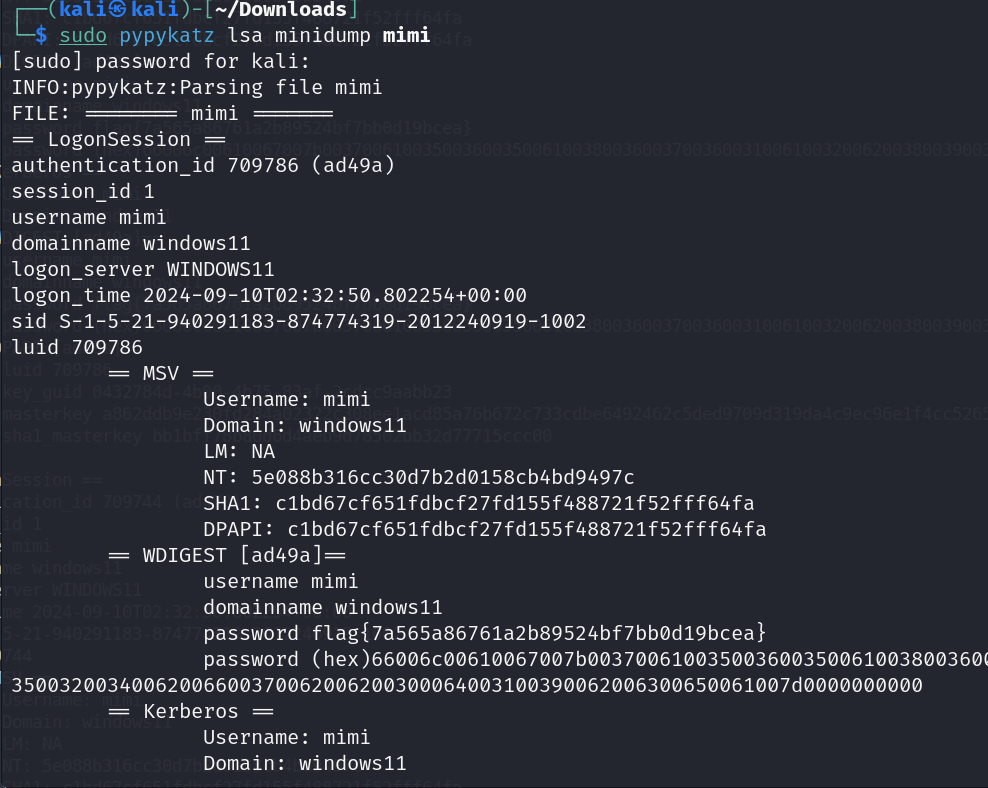

# Mimi

**Description:**

<small>Author: @JohnHammond</small>  Uh oh! Mimi forgot her password for her Windows laptop!    Luckily, she dumped one of the crucial processes running on her computer (don't ask me why, okay)...  can you help her recover her password?    <b>NOTE: Archive password is <code>mimi</code></b>    <b>Download the file(s) below.</b> 

**Category:** Warmups

**Difficulty:** easy

**File:** [mimi.7z](mimi.7z)

## Solution

After downloading the file mimi.7z, I extracted it using the provided password (mimi). The extracted file contained a memory dump, which often holds valuable information for recovering credentials on Windows.

I attempted to use pypykatz, a tool designed to extract credentials from Windows process dumps, but encountered some errors initially. After ensuring that Kali Linux and pypykatz were up-to-date resolved my issue.

After successfully running pypykatz on the memory dump, I was able to extract Mimi’s password, which contained the flag of `flag{7a565a86761a2b89524bf7bb0d19bcea}`  
