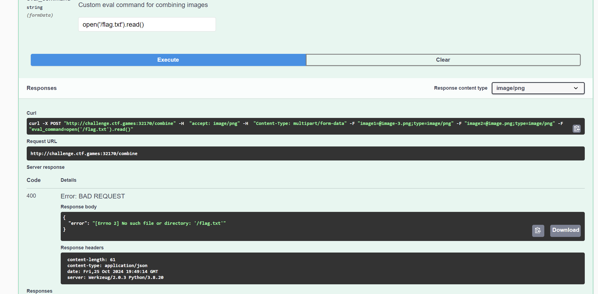
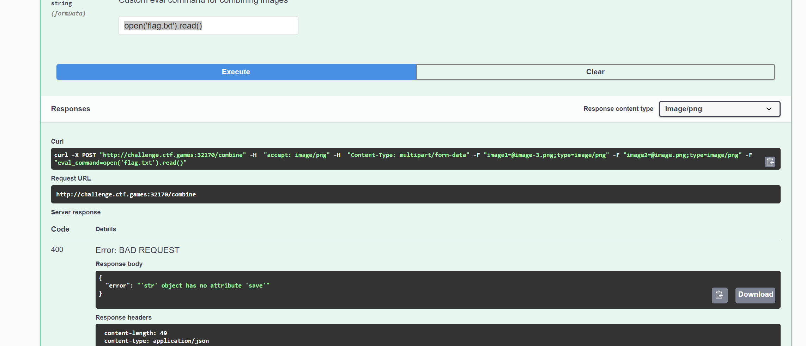
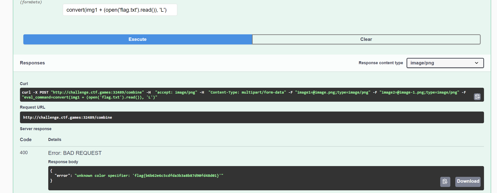

# PillowFight

**Description:**

<small>Author: @HuskyHacks</small>  PillowFight uses <i><b>advanced AI/MLRegressionLearning* </i></b> to combine two images of your choosing   
<small> *note to investors this is not techically true at the moment we're using a python library but please give us money and we'll deliver it we promise. </small>    <b>Press the <code>Start</code> button on the top-right to begin this challenge.</b>

**Category:** Web

**Difficulty:** easy

## Solution

First, I tried reading flag.txt directly with open('/flag.txt').read(), but this returned an error: "No such file or directory."
  

Next, I tried `open('flag.txt').read()`, which resulted in another error: `'str' object has no attribute 'save'`.  

After experimenting, I managed to read and process the flag content by combining it with an image. I used `convert(img1 + (open('flag.txt').read()), 'L')` to get the flag of `flag{b6b62e6c5cdfda3b3a8b87d90fd48d01}`  

