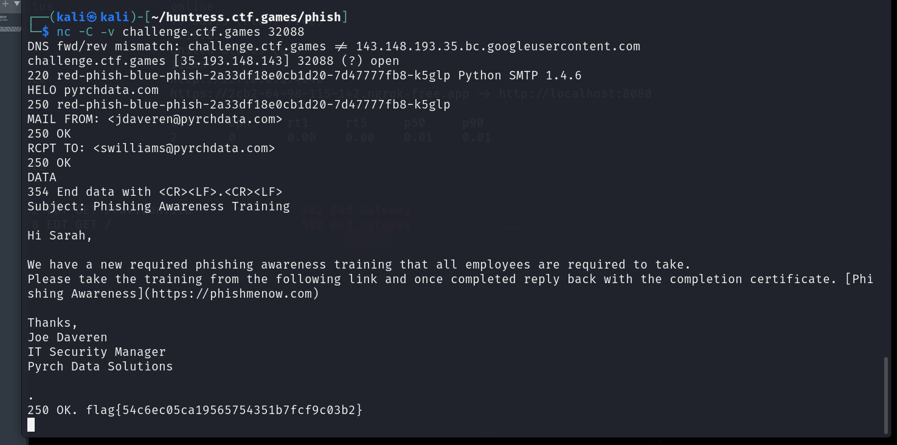

# Red Phish Blue Phish

**Description:**

<small>Author: Truman Kain (@truman.huntress), Adam Rice (@adam.huntress)</small><br><br>You are to conduct a phishing excercise against our client, Pyrch Data.  <br> <br> We've identified the Marketing Director, Sarah Williams (swilliams@pyrchdata.com), as a user susceptible to phishing. <br> <br> Are you able to successfully phish her? Remember your OSINT ;) <br> <br> <b>NOTE: The port that becomes accessible upon challenge deployment is an SMTP server. Please use this for sending any phishing emails.</b> <br> <br> <b>You will not receive an email/human response as the mail infrastructure for this challenge is emulated.</b> <br> <br> <br> <b>Press the <code>Start</code> button on the top-right to begin this challenge.</b>


**Category:** Miscellaneous

**Difficulty:** medium

## Solution


Using the provided information, I navigated to the Pyrch Data website: `pyrchdata.com`. Upon reviewing the “Meet the Team” page, I found a list of employees along with their job titles.


From the provided email address, `swilliams@pyrchdata.com`, I inferred that Pyrch Data follows an email format of first name initial + last name.

I connected to the SMTP server using nc (netcat) and received the following response `220 red-phish-blue-phis-c3fae1927f7d18f-7dc944975-slms Python SMTP 1.4.6`. 

After identifying Joe Daveren, the IT Security Manager at Pyrch Data, I spoofed his email to make the phishing attempt more convincing. The email was designed to appear as an official notification about mandatory phishing awareness training, including a link to a fake website.

```
HELO pyrchdata.com
MAIL FROM: <jdaveren@pyrchdata.com>
RCPT TO: <swilliams@pyrchdata.com>
DATA
Subject: Phishing Awareness Training

Hi Sarah,

We have a new required phishing awareness training that all employee are required to take. Please take the training from the following link and once completed reply back with the completion certificate. [Phishing Awareness](https://phishmenow.com).

Thanks,
Joe Daveren 
IT Security Manager
Pyrch Data Solutions

.


```

This provided the flag of `flag{54c6ec05ca19565754351b7fcf9c03b2}`

