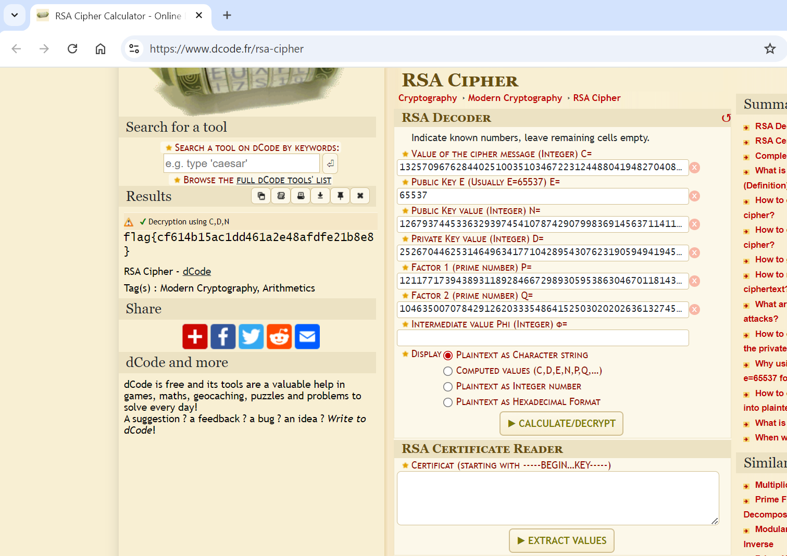

# Strive Marish Leadman TypeCDR

**Description:**

<small>Author: @aenygma</small><br><br>Looks like <a href="https://www.ntietz.com/blog/rsa-deceptively-simple/">primo hex garbage.</a> <br/> Maybe something went wrong? <br/> Can you make sense of it? <br/> <b>Press the <code>Start</code> button on the top-right to begin this challenge.</b>


**Category:** Cryptography

**Difficulty:** easy

## Solution

The challenge presented what appeared to be hex values, possibly related to RSA encryption. Based on the hint, I suspected it involved deciphering encrypted data using RSA keys in hexadecimal format.

To decode the hex values, I initially used an online RSA Cipher Calculator from decode.fr, which allowed me to input the RSA components in hexadecimal and retrieve the plaintext.  


To streamline the decryption process for future challenges, I created a Python script to perform the RSA decryption automatically. This script converts hex values to integers for the RSA parameters (p, q, d, n, c), calculates the plaintext, and converts it back to readable text.

The Python script successfully decrypted the ciphertext and revealed the flag:
`flag{cf614b15ac1dd461a2e48afdfe21b8e8}`

```python
p = int("e45cd448c09195ec3f86259c61b476bea0d5ed8efcf5f140c3617de206742d6bc76a7b30ddda02313efc2018df2e5a908e1926996b3f9ab1ad8793b7ab066267",16)
q = int("c6f4ea408e738be715e8b3e746634761b2f4ae60044cacf3b4edd16c884476706d435b57a6a6b1e84272b4f567b4699eca8941c72b3204a22fc7cdf6273788a1",16)
d = int("728554c2cae5ac8203781d6d0517b6bc981224d8a2bd88619399552079d79baeaba644717ac5825025edd601339b65d97cdd86a0b8ee2554e042a55cc58e063728210b51e883769f18ae2bb11ff006dd25f00dd7d95944d21fd619df4cf9f45e94335ae29f2c143bfd1b0660be5ec4f277264ceb561be9dfb36fd9bc2d4463c1", 16)
n = int("b17a45a10a9a472d17cf3cdd116260317ca4468d9d72dc86d3468bfb5e6b12aa35eb3c9ceda856ac52a19e40c55fea6e2df7068887a45062bb4237c6319eb7b106848c75f8f6ecd9130869c5e16d59ec204547115dc0eedf105d761838391f9941b0140fcf39f3a1e517d9ea575f711b635db1a4413aa337bc413ab4c86b9ac7", 16)
c = int("70b4b71cc5297bd52c42d470c96e2f10bbb51194f9c580c7b8cb55212f2baa6a0b4b0f33afddb6942f3ec60a447bf5273df8a4dca73405a9566781054acc62b0d6d703b1029d62e2129eee791ddb99fa49afe19726a081adb9af7d62c7e7c7c56e29cb61ee0f27c97b7488d6ba6ae1fb9dbfb0eadcf53ae7537f2fec455059ba",16)
e = 0x1001
pt = pow(c,d,n)
print(bytes.fromhex(hex(pt).replace("0x","")))
```