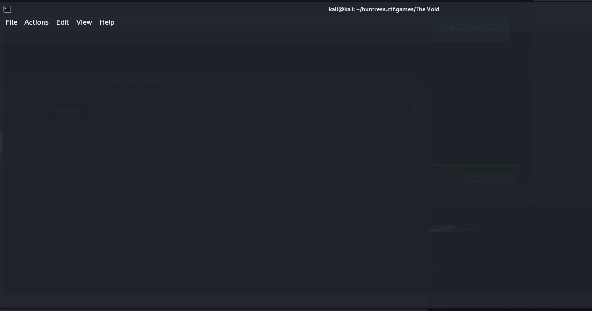
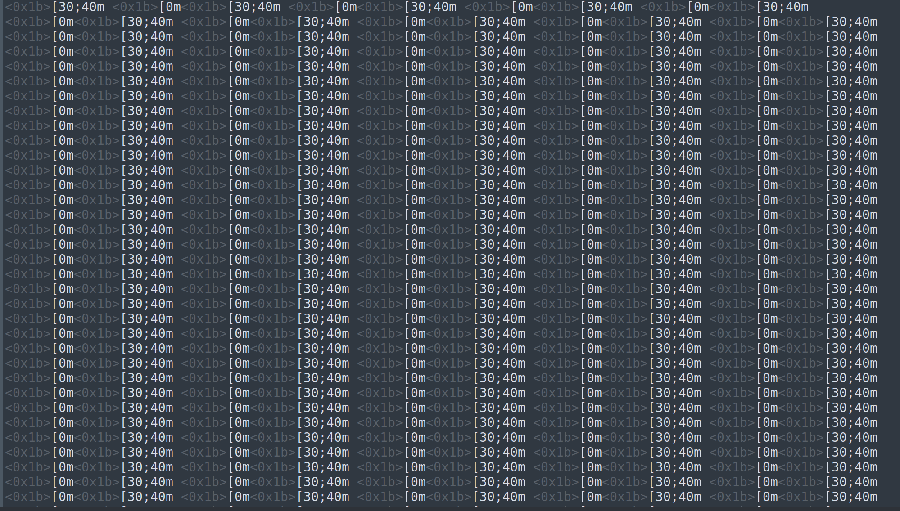
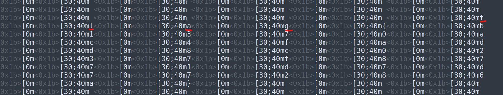

# The Void

**Description:**

<small>Author: @JohnHammond#6971</small>  When you gaze long into the void, the void gazes also into you...    <b>Press the <code>Start</code> button on the top-right to begin this challenge.</b>

**Category:** Warmups

**Difficulty:** easy

## Solution

Used the provided command: `nc challenge.ctf.games 30463` to connect to the challenge server. It appeared to be displaying a black screen.

To capture the output for closer inspection, I redirected the data into a file using `nc challenge.ctf.games > out.txt`

Upon opening the output file, I noticed the majority of the content was repetitive, with just a few deviations

By scanning through the results, I identified areas where the repeating pattern was broken.

These breaks contained the flag. After performing a find-and-replace to remove the repetitive patterns, for a flag of `flag{b1370ac4fadd8c0237f8771d7d77286a}`