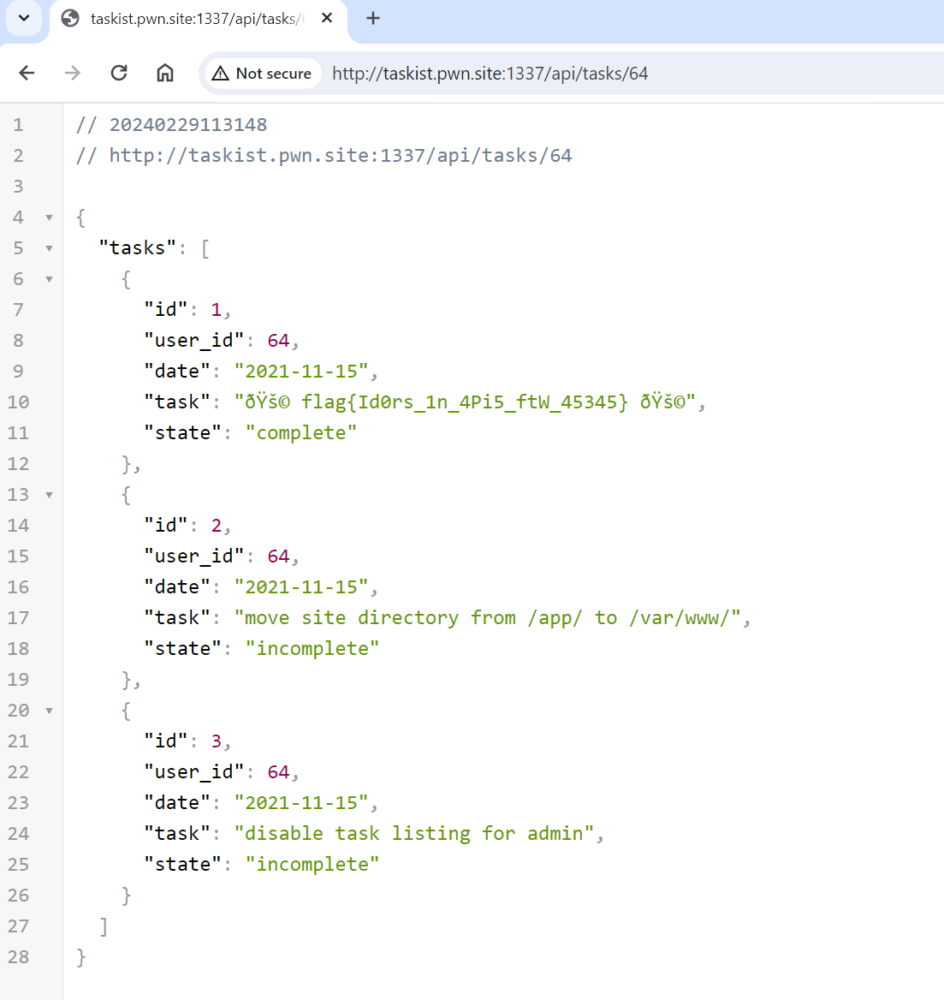

# Taskist 001 100pts

BRIEFING
We are working on this amazing new task manager app called Taskist Pro. Our devs claim the app is secure, we want you to take a look at it and see if you can leak the flag hidden inside the admin account.

http://taskist.pwn.site:1337/

## Solution

Created an account and successfully logged in.
Observed the request for retrieving tasks associated with users.

Proceeded to pull down all tasks until locating the one assigned to user 64, which contained the flag.

flag `flag{Id0rs_1n_4Pi5_ftW_45345}`

