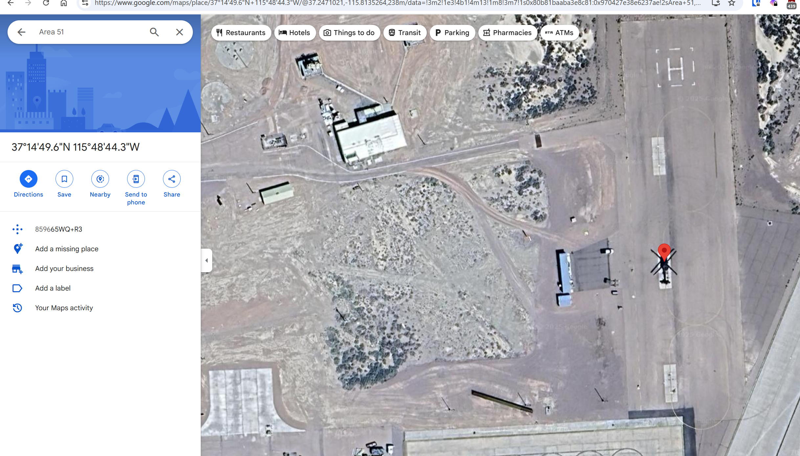

# The Mechanical Bird's Nest

**Creator:** ch4p

**Description:** In the highest tower of Eldoria's archives, Nyla manipulates a crystal scrying glass, focusing on a forbidden fortress in the desert kingdoms. The Queen's agents have discovered a strange mechanical bird within the fortress walls—an unusual flying machine whose exact position could reveal strategic secrets. Nyla's fingers trace precise measurement runes across the crystal's surface as the aerial image sharpens. Her magical lattice grid overlays the vision, calculating exact distances and positions. The blue runes along her sleeves pulse rhythmically as coordinates appear in glowing script. Another hidden truth uncovered by the realm's premier information seeker, who knows that even the most distant secrets cannot hide from one who sees with magical precision.
 <b>The Mechanical Bird’s Nest: HTB{XX.XXX_-XXX.XXX}
Example: HTB{48.858_-222.294} Latitude and longitude format with a dash separating the coordinates</b>

**Category:** OSINT

**Difficulty:** easy

**File:** osint_the_mechanical_birds_nest.zip

## Solution 

Performed a reverse image search using Google. 

Found a relevant Reddit post on r/area51:
https://www.reddit.com/r/area51/comments/1ec5rln/are_these_testers_or_interceptors/?sort=old

This led me to investigate Google Maps around Area 51.

Scanned nearby runways and hangars until I visually matched the structures from the image provided

Pinpointed the exact coordinates of the mechanical bird's nest to get the flag of `HTB{37.247_-115.812}`
