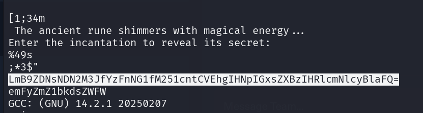
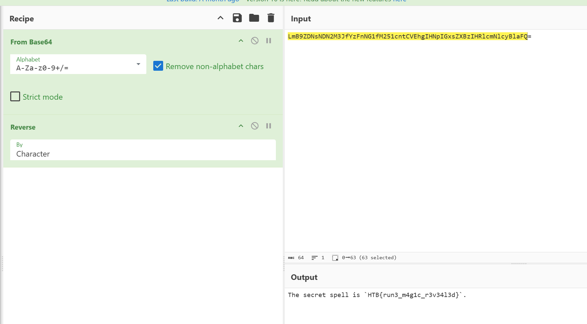

# SealedRune

**Creator:** ch4p

**Description:** Elowen has reached the Ruins of Eldrath, where she finds a sealed rune stone glowing with ancient power. The rune is inscribed with a secret incantation that must be spoken to unlock the next step in her journey to find The Dragon’s Heart.

**Category:** Reversing

**Difficulty:** very easy

**File:** rev_sealedrune.zip

## Solution 

I started by running the `strings` command on the binary, which revealed a suspicious base64-encoded string:

Decoding it gave:
`}d3l43v3r_c1g4m_3nur{BTH` si lleps terces ehT 

This looked like a reversed sentence, so I reversed the entire string that included the flag:`HTB{run3_m4g1c_r3v34l3d}`.

