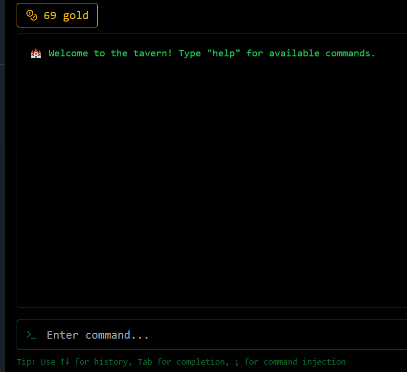
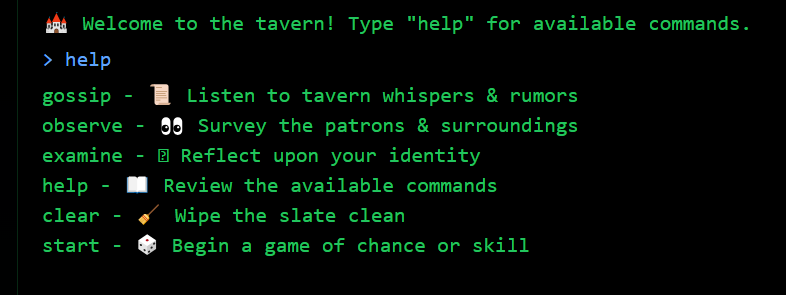
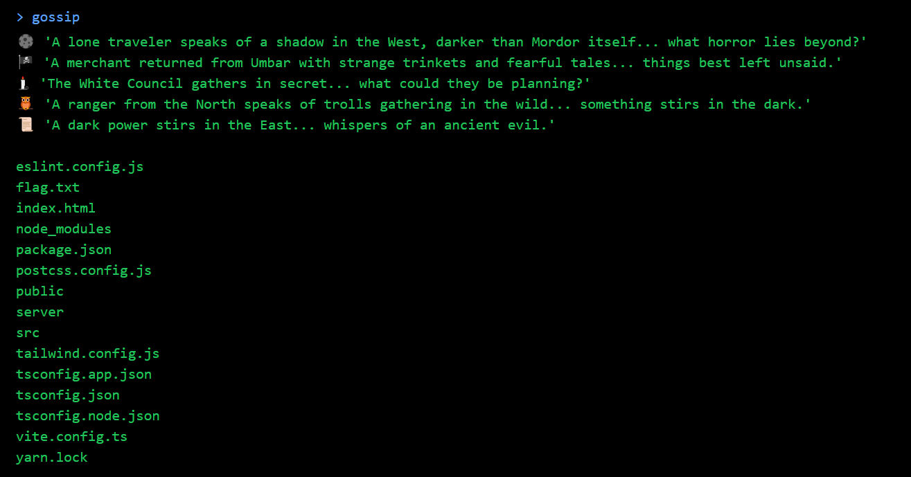
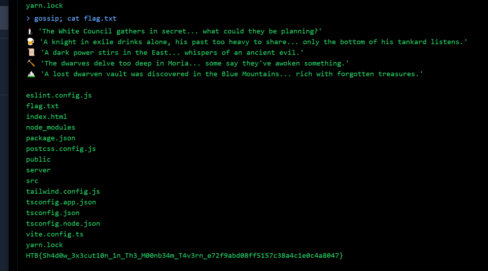

# Whispers of the Moonbeam

**Creator:** makelaris

**Description:** In the heart of Valeria's bustling capital, the Moonbeam Tavern stands as a lively hub of whispers, wagers, and illicit dealings. Beneath the laughter of drunken patrons and the clinking of tankards, it is said that the tavern harbors more than just ale and merriment—it is a covert meeting ground for spies, thieves, and those loyal to Malakar's cause.

The Fellowship has learned that within the hidden backrooms of the Moonbeam Tavern, a crucial piece of information is being traded—the location of the Shadow Veil Cartographer, an informant who possesses a long-lost map detailing Malakar’s stronghold defenses. If the fellowship is to stand any chance of breaching the Obsidian Citadel, they must obtain this map before it falls into enemy hands.

**Category:** Web

**Difficulty:** very easy

**Points:** 900

**Solves:** 953

**File:** 

## Solution 

Upon opening the site, I was greeted with a terminal-like interface:

I typed `help` to list available commands:  

Running the `gossip` command included a list of files.  

This hinted at possible command injection, so I tried appending a command using a semicolon: `gossip; cat flag.txt`.

The server executed both commands, and the contents of flag.txt were displayed: `HTB{Sh4d0w_3x3cut10n_1n_Th3_M00nb34m_T4v3rn_e72f9abd08ff5157c38a4c1e0c4a8047}`
