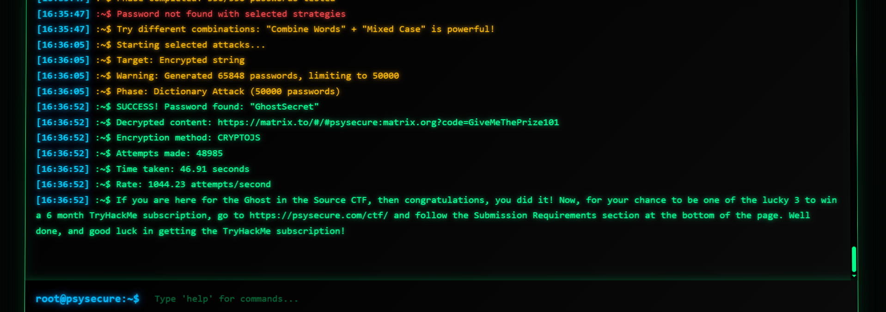

# 🕵️‍♂️ Ghost in the Source CTF

**Hosted by [PsySecure](https://psysecure.com/ctf/)**  
📅 **Date:** June 21, 2025 – 12:00 PM EDT

Welcome to an opportunity to test your hacking skills by breaking client-side encryption to uncover a closely guarded secret hidden somewhere on the site. This challenge is a gift to the privacy and security community—and to our loyal podcast listeners.

🎁 **Prizes:**  
Three randomly selected participants who successfully capture the flag will receive a **6-month subscription gift code to [TryHackMe](https://tryhackme.com)**!

---

## 🚀 Quick Start

### 🔍 Find  
Begin by scouring the site for clues—view source code, explore the structure, and apply your hacker intuition.

### 🧠 Decrypt  
Found something that looks like encryption? Time to put your cryptographic cracking skills to work. (If only there was a tool to help…)

### 📬 Submit  
Once you’ve cracked the code, use the contact form on the site to submit your solution. (Details below.)

### 🏆 Claim  
Three eligible submissions will be chosen **at random** to receive the prize. See the criteria below.

---

## 🎯 Submission Requirements

✅ **Correct Flag**  
Your submission must contain the correct flag to be considered.

🎲 **Random Drawing**  
Out of all correct submissions, **three will be randomly selected**.

👤 **One Entry Per Person**  
To ensure fairness, only one submission per participant will be accepted.

---

## 🏆 Prizes

- 🎟️ **6-Month TryHackMe Premium Voucher**  
  Premium access to hands-on cybersecurity training.

- 🔄 **3 Winners Chosen at Random**  
  All correct submissions are eligible—technique and correctness matter!

- 👥 **Fairness Policy**  
  Only one winner per person. Multiple submissions from the same person will be disqualified.

---

> 🧠 **Note:** This challenge is independently organized and funded by PsySecure as a community giveback initiative. It is not affiliated with any third-party service providers.

---

## ✍️ Writeup Section

The CTF challenge provided the hint: "pay attention to JavaScript and its contents."
This led me to inspect the website's source code, where I discovered the following encrypted string on the podcast page  
```
const encrypted = "U2FsdGVkX1+ASV9EBO5yBQwFFXLaKRB4SgWAZ6SKRKSy5iuQ7tGq1/tUuRm6e+TZp1Z5C9t1kUV22biCtLId/0j50x3IPcqjJqtFTOJnRNdWhxg40HXbVSXRc9ioURoW";
```

One of the clues referenced a YouTube video discussing the importance of robots.txt. Based on this, I explored the site's robots.txt file and found a path to a hidden tool at:
```
/tools/ciphertool.html
```

I used the CipherTool page and enabled the Harvest feature to generate a wordlist based on content from the psysecure.com website. 

CipherTool Configuration:
- Mode: AES Cracking
- Wordlist Options:
  - Combine two words
  - All combinations
  - Mixed case
  - Use a separator

- Encrypted Message: `U2FsdGVkX1+ASV9EBO5yBQwFFXLaKRB4SgWAZ6SKRKSy5iuQ7tGq1/tUuRm6e+TZp1Z5C9t1kUV22biCtLId/0j50x3IPcqjJqtFTOJnRNdWhxg40HXbVSXRc9ioURoW`

Password: `GhostSecret`

Decrypted Output: `https://matrix.to/#/#psysecure:matrix.org?code=GiveMeThePrize101`  
