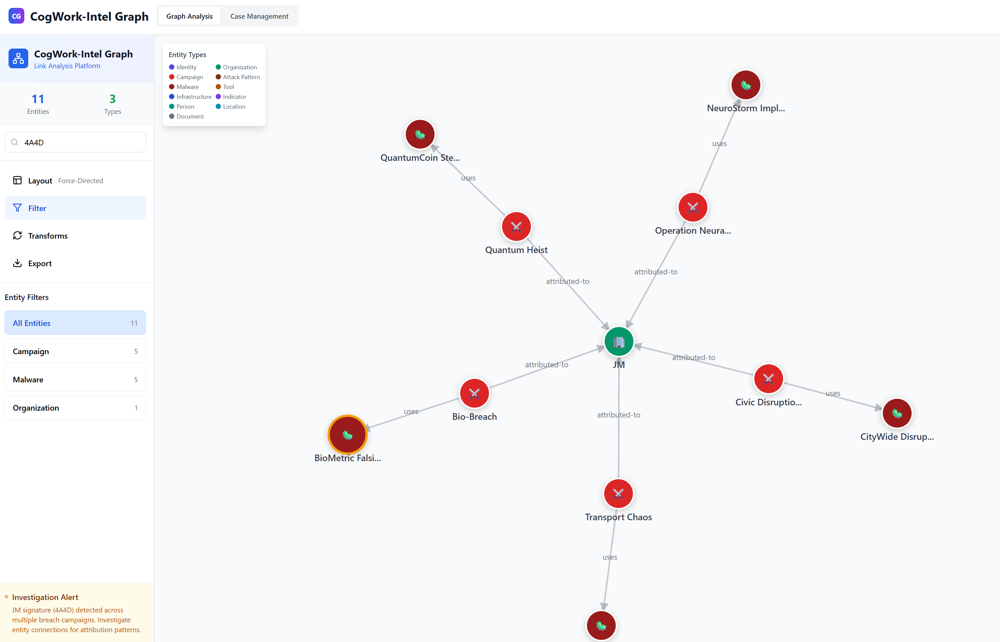
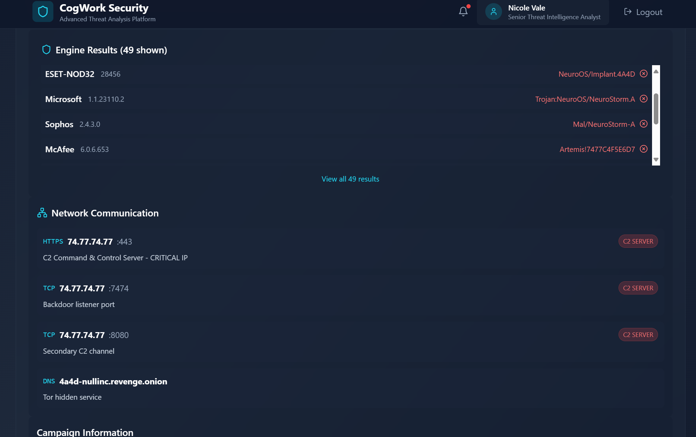
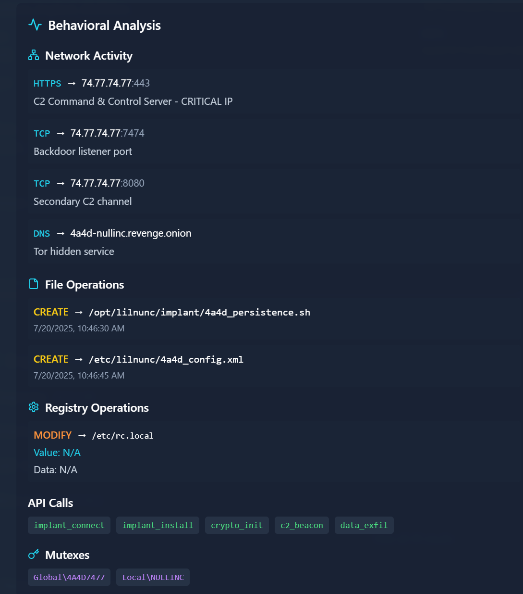
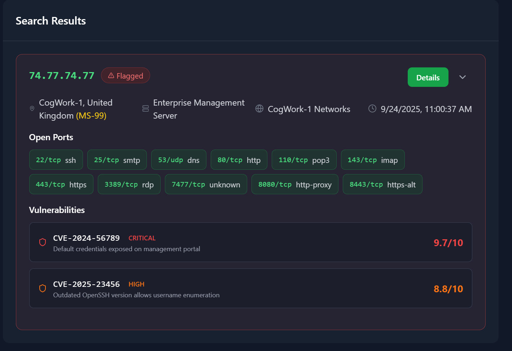
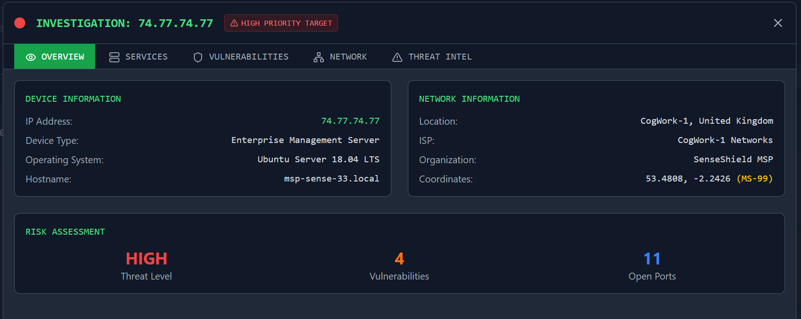
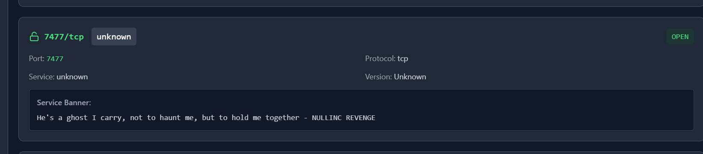

# The Card

Holmes receives a breadcrumb from Dr. Nicole Vale - fragments from a string of cyber incidents across Cogwork-1. Each lead ends the same way: a digital calling card signed JM.


## Question 01 - Analyze the provided logs and identify what is the first User-Agent used by the attacker against Nicole Vale's honeypot. (string)

I examined `access.log` and located the user-agent string used by the attacker: `Lilnunc/4A4D - SpecterEye`


## Question 02 - It appears the threat actor deployed a web shell after bypassing the WAF. What is the file name? (filename.ext)

From the `waf.log` contains entries indicating a bypass and creation of a PHP web shell:
```
2025-05-15 11:25:01 [CRITICAL] waf.exec - IP 121.36.37.224 - Rule: WEBSHELL_DEPLOYMENT - Action: BYPASS - Web shell creation detected
2025-05-15 11:25:12 [CRITICAL] waf.exec - IP 121.36.37.224 - Rule: WEBSHELL_DEPLOYMENT - Action: BYPASS - PHP web shell temp_4A4D.php created
```

This shows the deployed file name is `temp_4A4D.php` 


## Question 03 - The threat actor also managed to exfiltrate some data. What is the name of the database that was exfiltrated? (filename.ext)

The `waf.log` contains an entry for a database download
```
2025-05-18 14:58:23 [CRITICAL] waf.exec - IP 121.36.37.224 - Rule: DATABASE_DOWNLOAD - Action: BYPASS - Database file download: database_dump_4A4D.sql
```
The databse file name is `database_dump_4A4D.sql`

## Question 04 - During the attack, a seemingly meaningless string seems to be recurring. Which one is it? (string)

Looking at the waf.log file at first I was focused on these logs.
```
2025-05-15 11:23:45 [ERROR] H�D$81���� - IP 121.36.37.224 - Rule: COMMAND_INJECTION - Action: �H�k�H�-�,H�L�I���� - Unknown error
2025-05-15 11:24:12 [ERROR] H�D$81���� - IP 121.36.37.224 - Rule: COMMAND_INJECTION - Action: �H�k�H�-�,H�L�I���� - Unknown error
2025-05-15 11:24:23 [ERROR] H�D$81���� - IP 121.36.37.224 - Rule: FILE_SYSTEM_ACCESS - Action: �H�k�H�-�,H�L�I���� - Unknown error
2025-05-15 11:24:34 [ERROR] H�D$81���� - IP 121.36.37.224 - Rule: DATA_EXFILTRATION - Action: �H�k�H�-�,H�L�I���� - Unknown error
```

After some time of trying the different text and even attampting to decoding them with cyberchef I realized I was pointed in the wrong direction. 

I dropped the log into ChatGPT along with the description for this flag and it pointed out the `4A4D` text being used, something I was over looking. 


## Question 05 -  OmniYard-3 (formerly Scotland Yard) has granted you access to its CTI platform. Browse to the first IP:port address and count how many campaigns appear to be linked to the honeypot attack.

Filtering on 4A4D shows 5 campaigns.
Campaigns identified:
- Quantum Heist
- Operation Neural Storm
- Civic Disruption
- Transport Chaos
- Bio-Breach 




## Question 06 - How many tools and malware in total are linked to the previously identified campaigns? (number)

Looked at the tools and malware for each campaign with a total of 9. 
* Bio-Breach
  *  Tools: MedSys Probe
    * Malware: BioMetric Falsifier

* Quantum Heist
    * Tools: QuantumKeyX
    * Malware: QuantumCoin Stealer

* Operation Neural Storm
    * Tools: NeuroScan Pro
    * Malware: NeuroStorm Implant

* Civic Disruption
    * Tools: CityMap Infiltrator
    * Malware: CityWide Disruptor

* Transport Chaos
    * Malware: Vehicle Chaos Engine


## Question 07 - It appears that the threat actor has always used the same malware in their campaigns. What is its SHA-256 hash? (sha-256 hash) 

I filtered by malware indicators and copied the SHA‑256 hash shown under the Indicators/Links view to get the hash of `7477c4f5e6d7c8b9a0f1e2d3c4b5a6f7e8d9c0b1a2f3e4d5c6b7a8f9e0d17477`


## Question 08 - Browse to the second IP:port address and use the CogWork Security Platform to look for the hash and locate the IP address to which the malware connects. (Credentials: nvale/CogworkBurning!)

Searching the hash in CogWork revealed network communications with the remote IP of `74.77.74.77` is listed under the network communication section 



## Question 09 - What is the full path of the file that the malware created to ensure its persistence on systems? (/path/filename.ext)

In the the Detailed Analysis section shows the malware created a persistence script at `/opt/lilnunc/implant/4a4d_persistence.sh`



## Question 10 - Finally, browse to the third IP:port address and use the CogNet Scanner Platform to discover additional details about the TA's infrastructure. How many open ports does the server have?

Searching for the IP using CogNet site showed 11 ports.


 
## Question 11 - Which organization does the previously identified IP belong to? (string)

Under the Overview tab shows the Organization as `SenseShield MSP`



## Question 12 - One of the exposed services displays a banner containing a cryptic message. What is it? (string)

Under the Services shows `He's a ghost I carry, not to haunt me, but to hold me together - NULLINC REVENGE`.
