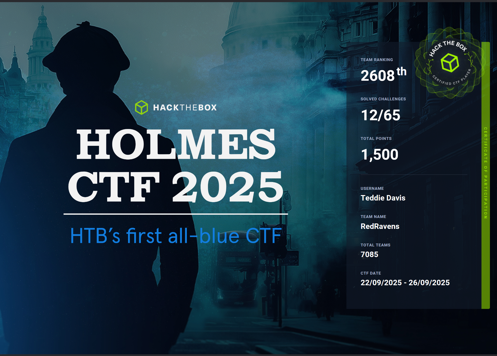

# Hack The Box Holmes CTF 

**Dates:** September 22 – 26, 2026

## Event Overview 
Welcome to HTB’s first-ever Blue CTF! This gauntlet of Sherlock-style challenges leads you through a case that has yet to be solved! 

Joining this event will allow you to investigate a range of scenarios: 

    Threat Intelligence
    SOC
    DFIR
    Malware Reversing 

With a team of 5, use your collective wit to dive into this forensic mystery and resolve an issue plaguing the city of Cogwork-1. 

## Challenges 

| Title | Category | Difficulty | Solved | Writeup |
| --- | --- | --- | --- | --- |
| [The Card](The_Card/readme.md) |  | easy | :heavy_check_mark: | :heavy_check_mark: |

## Certificate

