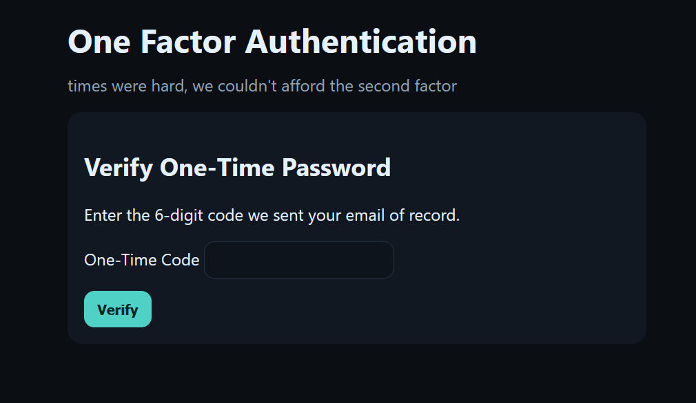
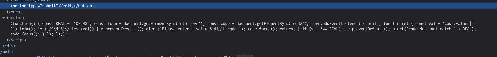
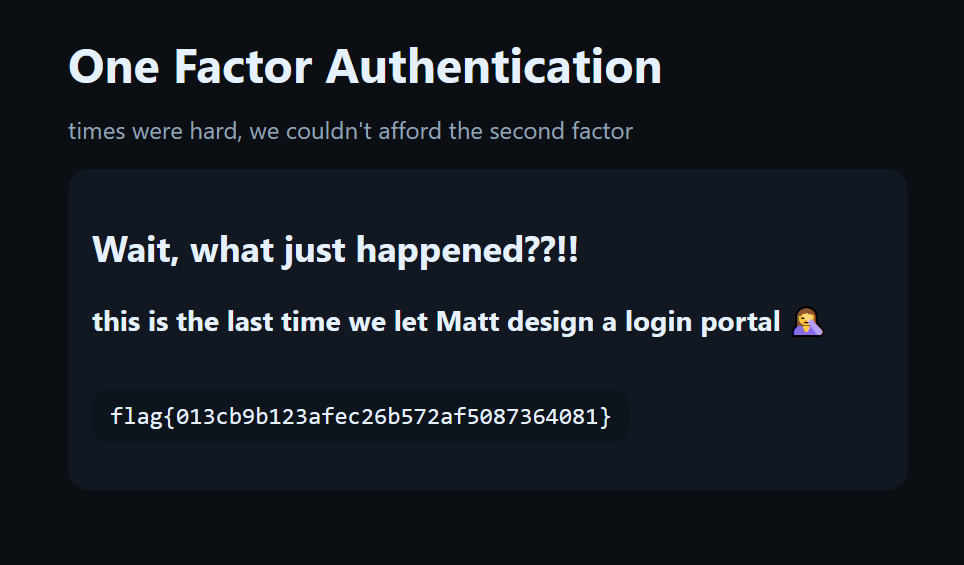

# OFA - Day 02
**Category:** Warmups
**Author:**  Matt Kiely (HuskyHacks)  

## Challenge Prompt 

Two factors? In this economy??!!

## Solution

Visiting the challenge page displays a simple login form that asks for a username and password:

Entering any credentials (e.g., user:test) proceeds to a second prompt for a one-time password (OTP):

I inspected the page's source code. Inside the HTML, there was a small JavaScript snippet that contained a numeric code `103248`:

Entering that `103248` code into the OTP form successfully completed the login and revealed the flag: `flag{013cb9b123afec26b572af5087364081}`

