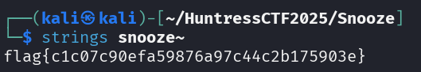

# Snooze - Day 04
**Category:** Warmups
**Author:**  [John Hammond](https://www.youtube.com/@_JohnHammond) 

## Challenge Prompt 

Don't bug me, I'm sleeping! Zzzz... zzz... zzzz....

Uncover the flag from the file presented.

## Solution

Identify the file type by running the `file` command:
`snooze: compress'd data 16 bits`

The repeated "zzz" hint and the file output suggest a compressed archive, likely 7z.

Extract the archive:
`7z x snooze`

Inspect the extracted file for readable text to get the flag `flag{c1c07c90efa59876a97c44c2b175903e}`  

