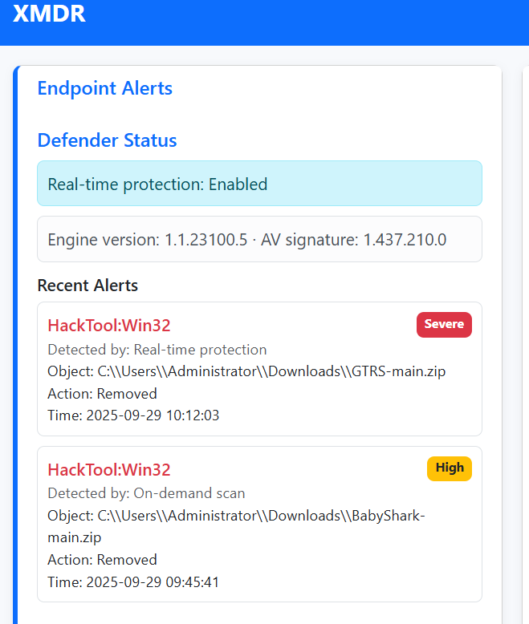
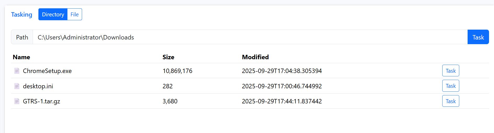
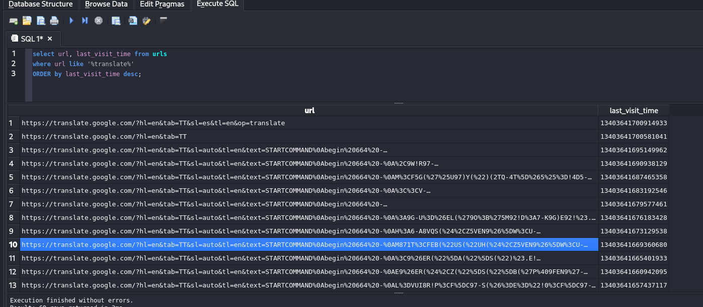
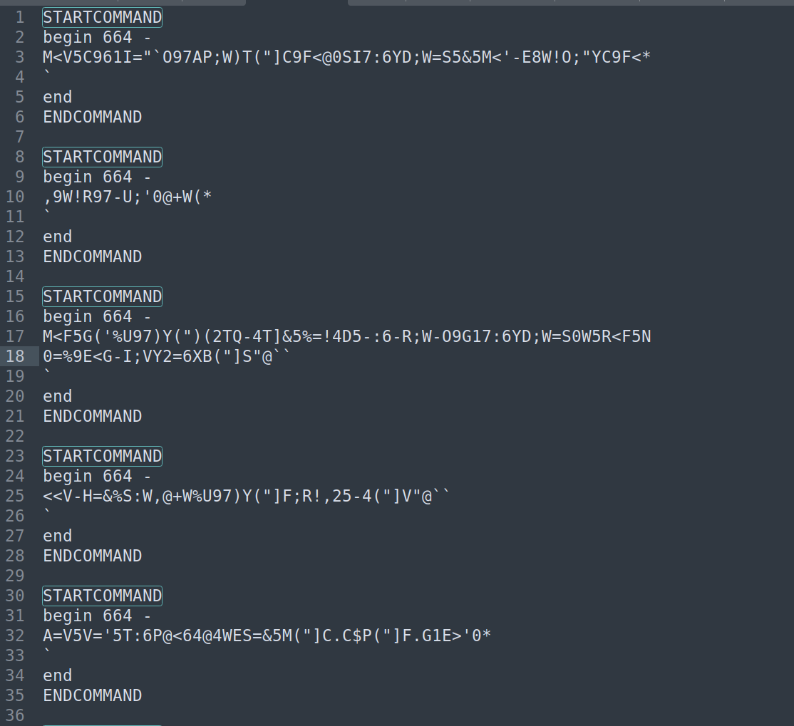
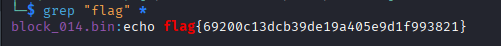

# XMDR - Day 19
**Category:** Miscellaneous
**Author:**  [John Hammond](https://www.youtube.com/@_JohnHammond) 


## Challenge Prompt 

We had a lot of fun helping the Internet understand what MDRs are, but we thought of the next the best thing:
**why not have you use one!** 😄

A host that you protect had some strange alerts fire off... can you analyze and triage to find other malicious activity?

## Solution

After opening the XMDR site, I checked the Recent Alerts section.  


It had two alerts listed with `GTRS-1.tar.gz` still in the downloads folder. 


From extacting I found two files of interest `client.go` and `client.sh`. The code within these files revealed that the attacker was using Google Translate as a C2 server.


Using XMDR, I obtained a copy of the browser history located at: `C:\Users\Administrator\AppData\Local\Google\Chrome\User Data\Default\History` 

Filtering URLs that contained “translate” revealed suspicious communication patterns


Exported the urls. Then used to get the commands from them.
Used the following command that extracts the text or u query parameters from each URL and decodes them
```bash
cat urls.txt \                           
  | python3 -c 'import sys,urllib.parse,re
for line in sys.stdin:
    m=re.search(r"[?&](?:text|u)=([^&\s]+)", line)
    if m:
        print(urllib.parse.unquote_plus(m.group(1)))' \
  > decoded_texts.txt
```

Decoded Texts:  


The decoded results contained uuencoded command blocks.


I used the following python script to automatically parse and decode the uuencoded command blocks.

```python
#!/usr/bin/env python3
"""
decode_translate_blocks.py

Usage:
  python3 decode_translate_blocks.py

Requires:
  - Python 3.x (uses only stdlib)
  - Optional: external 'uudecode' command (if present the script will try it first)

What it does:
  - Reads decoded_texts.txt in the current directory
  - Splits STARTCOMMAND..ENDCOMMAND blocks into blocks/block_001.uue, ...
  - Normalizes common HTML/Unicode artifacts into blocks_norm/
  - Attempts system uudecode on each normalized block (if 'uudecode' exists)
  - If system uudecode fails or is missing, performs a robust per-line manual uudecode
    that skips corrupted lines and recovers as much as possible.
  - Writes binary outputs to decoded/block_001.bin, ...
  - Prints a summary of outputs
"""
from __future__ import print_function
import os, sys, re, shutil, subprocess, binascii

INFILE = "decoded_texts.txt"
BLOCK_DIR = "blocks"
NORM_DIR = "blocks_norm"
OUT_DIR = "decoded"

def read_input(path):
    with open(path, "r", encoding="utf-8", errors="replace") as f:
        return f.read()

def split_blocks(text):
    # Extract everything between STARTCOMMAND and ENDCOMMAND inclusive
    pattern = re.compile(r"STARTCOMMAND\s*(.*?)\s*ENDCOMMAND", re.IGNORECASE | re.DOTALL)
    matches = pattern.findall(text)
    return matches

def normalize_block(s):
    # Basic normalizations to undo HTML/translate mangling
    # remove literal "amp;" artifacts, unicode replacement chars, fancy quotes, CRs
    s = s.replace("amp;", "")
    s = s.replace("\r", "")
    # remove Unicode replacement character (U+FFFD)
    s = s.replace("\ufffd", "")
    # replacement bytes sometimes appear as \xef\xbf\xbd in raw; ensure removed if present
    s = s.replace("\xef\xbf\xbd", "")
    # fancy quotes
    s = s.replace("“", '"').replace("”", '"').replace("’", "'").replace("–", "-")
    # Some transforms: remove leading/trailing spaces on lines
    lines = [ln.rstrip("\n") for ln in s.splitlines()]
    # Re-join using single \n
    return "\n".join(lines) + "\n"

def write_blocks(raw_blocks):
    os.makedirs(BLOCK_DIR, exist_ok=True)
    paths = []
    for i, block in enumerate(raw_blocks, start=1):
        p = os.path.join(BLOCK_DIR, f"block_{i:03d}.uue")
        with open(p, "w", encoding="utf-8", errors="replace") as f:
            f.write(block.strip() + "\n")
        paths.append(p)
    return paths

def write_normalized(block_paths):
    os.makedirs(NORM_DIR, exist_ok=True)
    norm_paths = []
    for p in block_paths:
        with open(p, "r", encoding="utf-8", errors="replace") as f:
            raw = f.read()
        norm = normalize_block(raw)
        np = os.path.join(NORM_DIR, os.path.basename(p))
        with open(np, "w", encoding="utf-8", errors="replace") as nf:
            nf.write(norm)
        norm_paths.append(np)
    return norm_paths

def try_system_uudecode(norm_path, out_path):
    """
    Attempt to call external uudecode if present.
    Different implementations have different CLI semantics. We'll attempt
    a few reasonable ways and detect outputs. Return True if out_path created.
    """
    uudecode_cmd = shutil.which("uudecode")
    if not uudecode_cmd:
        return False
    # Record existing files in cwd to detect new files created by some uudecode variants
    cwd_before = set(os.listdir("."))
    # Try common call forms. We'll try 'uudecode -o <out> <in>' first (some implementations support -o),
    # then fall back to 'uudecode <in>' and move the created file (named by begin line) to out_path.
    # We run in a temporary isolated subprocess with cwd set to a temp folder to avoid file collisions.
    try:
        # Try -o form
        p = subprocess.run([uudecode_cmd, "-o", out_path, norm_path], stdout=subprocess.PIPE, stderr=subprocess.PIPE, timeout=8)
        if os.path.isfile(out_path) and os.path.getsize(out_path) > 0:
            return True
    except Exception:
        pass
    try:
        # Try calling uudecode with single arg (some variants write file named in 'begin' line)
        p = subprocess.run([uudecode_cmd, norm_path], stdout=subprocess.PIPE, stderr=subprocess.PIPE, timeout=8)
    except Exception:
        p = None
    # After running, see if any new files appeared in current dir
    cwd_after = set(os.listdir("."))
    new_files = cwd_after - cwd_before
    # If any new files and out_path doesn't exist, try to find a reasonable candidate
    if new_files:
        # pick the largest new file as candidate
        candidate = None
        largest = 0
        for nm in new_files:
            try:
                size = os.path.getsize(nm)
            except Exception:
                size = 0
            if size > largest:
                largest = size
                candidate = nm
        if candidate:
            try:
                shutil.move(candidate, out_path)
                return True
            except Exception:
                pass
    # If nothing worked
    return False

def manual_uudecode(norm_path, out_path):
    # Manual per-line decode using binascii.a2b_uu, skipping lines that can't decode
    out_bytes = bytearray()
    in_block = False
    wrote_any = False
    with open(norm_path, "r", encoding="utf-8", errors="replace") as f:
        for line in f:
            s = line.rstrip("\n")
            if not in_block:
                if s.lower().startswith("begin "):
                    in_block = True
                continue
            # stop at 'end'
            if s.strip().lower() == "end":
                break
            if not s.strip() or s.strip() == "`":
                continue
            try:
                # Try ascii-only conversion; ignore non-ascii
                b = binascii.a2b_uu(s.encode("ascii", errors="ignore"))
                if b:
                    out_bytes.extend(b)
                    wrote_any = True
            except Exception:
                # skip bad line
                continue
    with open(out_path, "wb") as of:
        of.write(out_bytes)
    return wrote_any

def extract_begin_filename(norm_path):
    # Try to parse 'begin <mode> <filename>' and return filename or None
    try:
        with open(norm_path, "r", encoding="utf-8", errors="replace") as f:
            first = f.readline()
        m = re.match(r"begin\s+\d+\s+(.*)", first, re.IGNORECASE)
        if m:
            return m.group(1).strip()
    except Exception:
        pass
    return None

def main():
    if not os.path.isfile(INFILE):
        print(f"ERROR: {INFILE} not found in current directory ({os.getcwd()})", file=sys.stderr)
        sys.exit(2)
    print("[*] Reading", INFILE)
    text = read_input(INFILE)
    raw_blocks = split_blocks(text)
    print(f"[*] Found {len(raw_blocks)} STARTCOMMAND blocks")
    if len(raw_blocks) == 0:
        print("No blocks found, exiting.")
        sys.exit(0)
    print("[*] Writing raw blocks to", BLOCK_DIR)
    block_paths = write_blocks(raw_blocks)
    print("[*] Normalizing blocks to", NORM_DIR)
    norm_paths = write_normalized(block_paths)
    os.makedirs(OUT_DIR, exist_ok=True)

    summary = []
    for np in norm_paths:
        base = os.path.basename(np).rsplit(".",1)[0]
        outp = os.path.join(OUT_DIR, base + ".bin")
        print(f"[+] Processing {np} -> {outp}")
        done = False
        # Try system uudecode first
        try:
            ok = try_system_uudecode(np, outp)
            if ok and os.path.isfile(outp) and os.path.getsize(outp) > 0:
                print(f"    [ok] system uudecode wrote {outp} ({os.path.getsize(outp)} bytes)")
                summary.append((np, outp, "system-uudecode", os.path.getsize(outp)))
                done = True
        except Exception as e:
            print("    [!] system uudecode attempt raised:", e)
        if not done:
            # Fallback: manual per-line decode
            wrote_any = manual_uudecode(np, outp)
            if wrote_any and os.path.isfile(outp) and os.path.getsize(outp) > 0:
                print(f"    [ok] manual uudecode wrote {outp} ({os.path.getsize(outp)} bytes)")
                summary.append((np, outp, "manual-uudecode", os.path.getsize(outp)))
                done = True
            else:
                # It may still write an empty file; remove if empty
                if os.path.isfile(outp) and os.path.getsize(outp) == 0:
                    try:
                        os.remove(outp)
                    except Exception:
                        pass
                # attempt to detect if the block contained a named file in 'begin' that system uudecode might have created in cwd
                fname = extract_begin_filename(np)
                if fname and os.path.isfile(fname):
                    # move it
                    try:
                        shutil.move(fname, outp)
                        print(f"    [ok] moved created file {fname} -> {outp}")
                        summary.append((np, outp, "moved-begin-file", os.path.getsize(outp)))
                        done = True
                    except Exception:
                        pass
        if not done:
            print(f"    [fail] could not extract binary from {np}")
            summary.append((np, None, "failed", 0))

    # Summary
    print("\n=== Summary ===")
    for src, outp, method, size in summary:
        print(f"{src} -> {outp}  method={method} size={size}")
    print("\nOutputs are in the directory:", OUT_DIR)
    print("Raw blocks are in:", BLOCK_DIR)
    print("Normalized blocks are in:", NORM_DIR)
    print("\nDONE.")

if __name__ == "__main__":
    main()

```
This script generates binary files for each decoded command block.

After decoding, I searched the output files for the flag using `grep`  
  
`flag{69200c13dcb39de19a405e9d1f993821}`