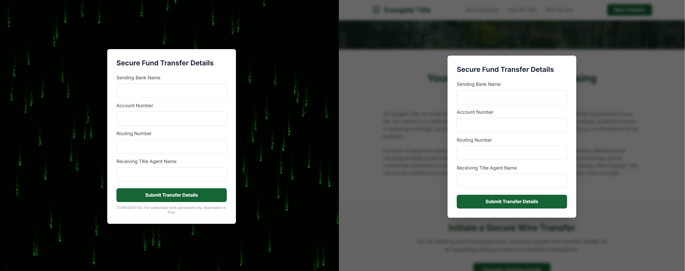
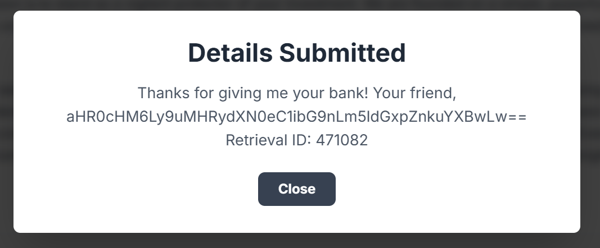
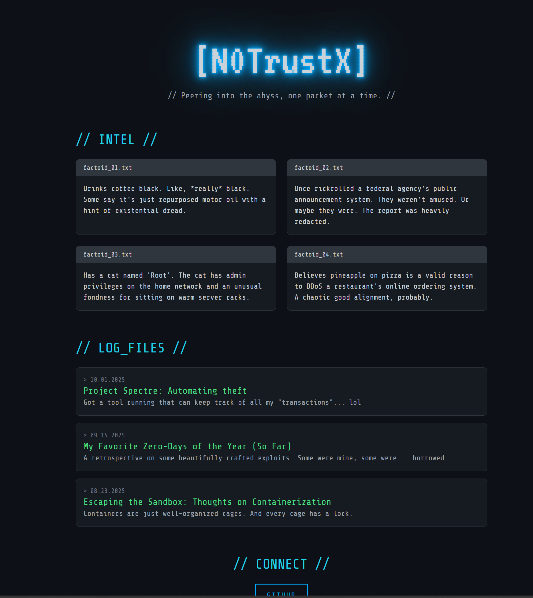
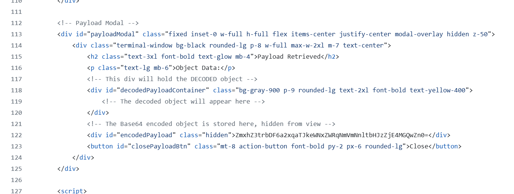

# Follow The Money - Day 21  
**Category:** Miscellaneous
**Author:**  @Brady

## Challenge Prompt 

Hey Support Team,

We had a bit of an issue yesterday that I need you to look into ASAP. There's been a possible case of money fraud involving our client, **Harbor Line Bank**. They handle a lot of transfers for real estate down payments, but the most recent one doesn't appear to have gone through correctly.

Here's the deal, we need to figure out what happened and where the money might have gone. The titling company is looping in their incident response firm to investigate from their end. I need you to quietly review things on our end and see what you can find. Keep it discreet and be passive.

I let **Evelyn** over at **Harbor Line** know that someone from our team might reach out. Her main email is offline right now just in case it was compromised, she's using a temporary address until things get sorted out:

```
evelyn.carter@51tjxh.onmicrosoft.com
```

> **IMPORTANT**: This challenge uses a non-standard flag format.    

> **NOTE**: The password to the ZIP archive below is `follow_the_money`

### Questions 
- What is the username of the hacker? 3 points: `n0trustx`
- Submit the flag below. 7 points: `flag{kl1zklji2dycqedj6ef6ymlrsf180d0f}`

## Solution

Sent an email to the temp email for Evelyn and got a replay of 

```
Hi,
I’m assuming you’re reaching out about the situation everyone’s been asking about? It’s honestly been a bit overwhelming.
From my side, I was just going through the usual process. Everything seemed normal at first, the same steps I’ve always followed. But this last time there was an issue, and I ended up having to re-send things. I went through the same transfer process. Things felt a little different with that. I was in such a rush to get the transfer because our client was in the middle of closing. Now that you ask, I feel like things looked a little different too, but since I was in such a rush, I don't remember what exactly.
That’s really all I remember. I’ve shared my emails from this past year in case they help clear things up.

Call me if you need anything else. 
Thanks,
```

This gives us some clues to go on. That she needed to re-send the transfer and the second time around the process felt a little different along with things looked a little different. 

Extracting the zip contained 5 emails messages between Evelyn Carter and Justin Case.

Looking over the emails in the 5th one Justin says
```
Good Day Evelyn, 

I see you sent over the payment. Unfortunately it didnt go through. Kindly give it another try. Please continue to use the link in my signature.

Thank you very much,
```
With the link in his signature going to: `https://evergatetltle.netlify.app/`

When going back over the other emails and the signature from Justin found the address on the first emails was `https://evergatetitle.netlify.app/` and that it changed on the 5th email. It's a very small change that could be missed with the `i` in title being changed to a lower case `l`.

At first viewing both sites appear to look the same. Once you click on 'Start Transfer' is when things start to look different. 



I put in dummy data and submited transfer details to see what happens and got the following message 
```
Details Submitted
Thanks for giving me your bank! Your friend, aHR0cHM6Ly9uMHRydXN0eC1ibG9nLm5ldGxpZnkuYXBwLw== Retrieval ID: 471082
```


Base64 decoded the string to get `https://n0trustx-blog.netlify.app/` 

Visting the site gives us a user name for the hacker of `n0trustx` and at the bottom has a link for the hackers github page `https://github.com/N0TrustX`.  



It had 1 repositoriy named Spectre with 2 files. 
Looking over the spectre.html file I found a base64 encoded string.


The strings decodes to be the flag of `flag{kl1zklji2dycqedj6ef6ymlrsf180d0f}`

