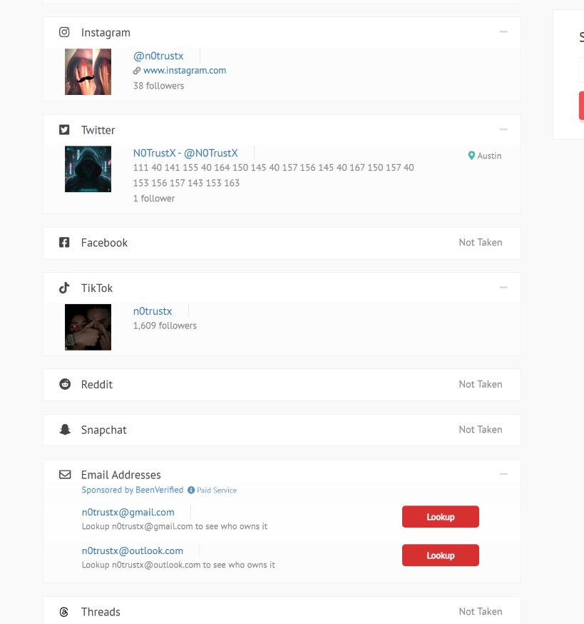
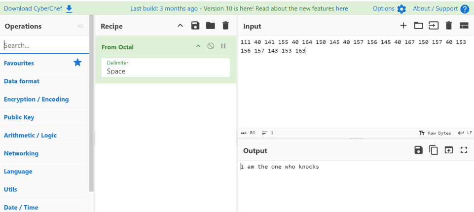
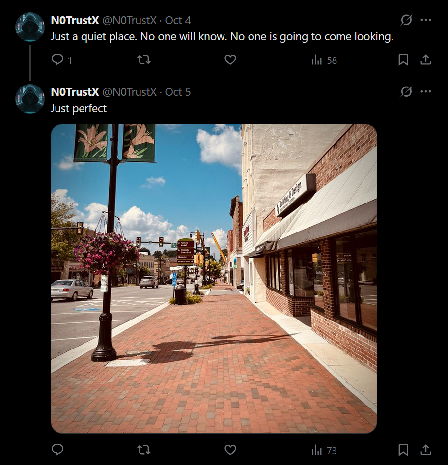
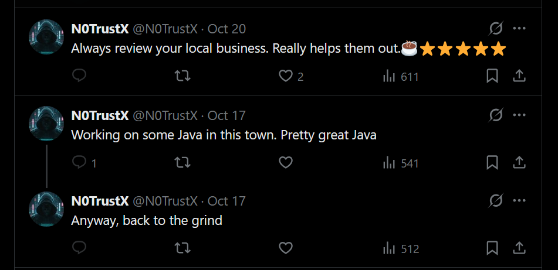
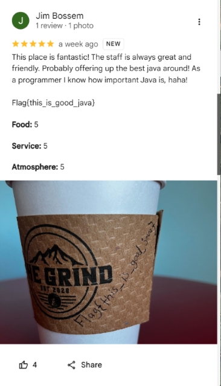

# Follow The Money: The Sequel - Day 27
**Category:** OSINT  
**Author:**  @Brady  

## Challenge Prompt 

> **Warning**: The initial Follow the Money challenge should be completed first before this challenge.

Hey Support Team,

Thanks for your help the other day! After seeing the way you handled yourself and gathered these details, I wanted to see if I could get a bit more help from you. I know you found their username the other day. See what you can do with that. I need you to find the town that this hacker lives in. I don't think the IR firm is doing enough. I want to have every piece of information we can find. Maybe we can pay a visit. Let me know what you find. Thanks!

### Questions 
- What town does our hacker friend live in? 5 points: `Wytheville`
- Can you find the nearby flag? 5 points: `Flag{this_is_good_java}`

> **IMPORTANT** This challenge DOES NOT require you to contact any businesses. This can be fully solved with publicly available information. Being that this is OSINT and public-facing, please DO NOT do anything to disrupt other CTF players or others that are not involved with the CTF. 

> **IMPORTANT** This challenge uses a non-standard flag format.

## Solution 

I began by searching for online accounts using the alias `n0trustx`. Using [https://www.idcrawl.com](https://www.idcrawl.com), I discovered several linked accounts, including TikTok and Twitter (X).

The TikTok profile for `n0trustx` showed tags for #panama. Initially, the TikTok hashtag #panama seemed promising, but entering “Panama” as the town proved incorrect.

On X, the account displayed the location Austin, which was also incorrect. However, an interesting string of numbers appeared in the bio: `111 40 141 155 40 164 150 145 40 157 156 145 40 167 150 157 40 153 156 157 143 153 163`

Decoding this sequence revealed the phrase: `I am the one who Knocks`.  While this reference didn’t directly help, it suggested a persona and hinted that the account might include more layered clues

Scrolling through older posts, I found one dated October 4 with the caption: `Just a quite place. No one will know. No one is going to come looking.` With a reply that read: `Just Perfect` 

The images included a street sign reading "Elizabeth Brown Park" and using Google I found Elizabeth Brown Park located in Wytheville, Va. 

The second question saying `nearby flag` hinted at something located around Wytheville. The X account had a few other posts about java (coffee) and another one about always review your local business.  

This gives us the clue that the flag could be in a review for a place that serves coffee. Searching for `Wytheville Va coffee` returned several coffee shops. After looking at a few of them I found a review on `The Grind` by a user named "Jim Bossem" containing the flag `Flag{this_is_good_java}`.  

