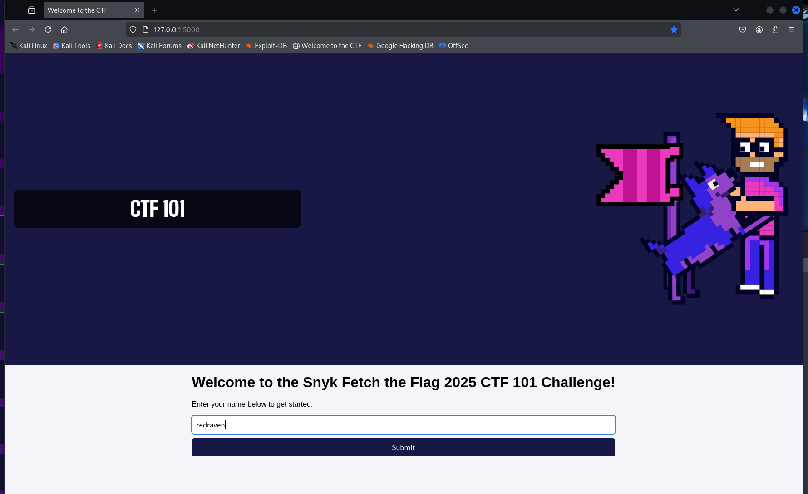
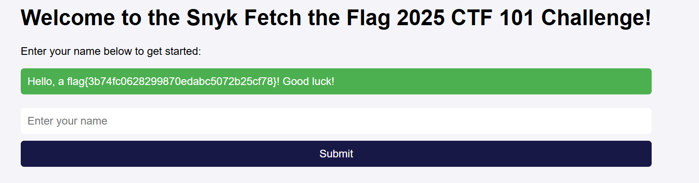

# CTF 101

**Description:**

<small>Author: @HuskyHacks</small>  <h2> If you are new to CTFs, start here! </h2>
Welcome to the CTF 101 challenge for the Snyk Fetch the Flag 2025 CTF! This challenge serves as an introduction to familiarize players with how the game works. It presents players with a simple challenge that emulates the challenges they will see on game day.  
Hopefully after you've completed this challenge, you'll be able to say that game day is "just like the simulations!"
   The challenge source code is available in the challenge.zip folder. The password is <code>snyk-ftf-2025</code>. Please read the README inside the zip file to get a full tutorial on how to play the CTF!
   Use the Dockerfile to run a local instance of the challenge! To build and the container, unzip the contents of the challenge.zip file and run:
 <code>docker build -t [challenge_name] . && docker run -it -p 5000:5000 [challenge_name]</code>
  
<b>Press the <code>Start</code> button on the top-right to begin this challenge.</b>

**Category:** Warmups

**Difficulty:** easy

**File:** [challenge.zip](challenge.zip)

## Solution

Extracted the challenge zip. Read over the readme in the files. Following the readme and started up the container and visited the site.

The notes from the readme.md sugest that getting the flag would be done by comand injection. Started up the container from the CTF, when asked for name input `; cat flag.txt` to get the flag of `flag{3b74fc0628299870edabc5072b25cf78}`

