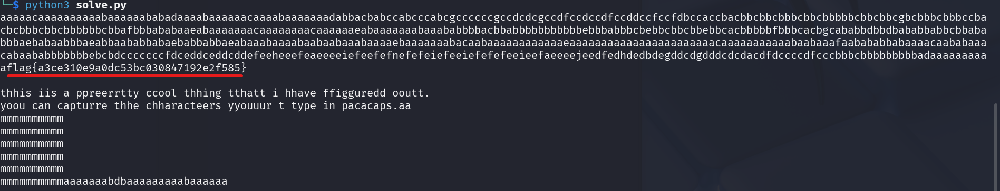

# ClickityClack

**Description:**

<small>Author: @Soups71</small><br><br>My friend said that he kept trying to message me the flag but it wouldn't work. He sent me a packet capture of his USB Bus to prove he was typing the flag, can you help me figure out what the flag is? <br><br> <b>Download the file(s) below.</b>


**Category:** Forensics

**Difficulty:** medium

**File:** [click.pcapng](click.pcapng)

## Solution

I recalled a similar challenge from another CTF, and a quick search lead me to this writeup: https://abawazeeer.medium.com/kaizen-ctf-2018-reverse-engineer-usb-keystrok-from-pcap-file-2412351679f4

While the approach was similar, there were some minor differences in the packet structure, requiring some adjustments.

Opened the file in Wireshark and applied a filter to isolate USB keyboard input.
`usb.transfer_type == 0x01 && usb.data_len > 0` 

Exported the filtered data to a CSV file for further processing.

Using the exported CSV, I wrote a Python script to extract and decode the HID (Human Interface Device) keycodes into readable text.
```python
import pandas as pd
df = pd.read_csv("CSVExport.csv")

hid_data_series = df["HID Data"].dropna()


hid_keymap = {
    0x04: 'a', 0x05: 'b', 0x06: 'c', 0x07: 'd', 0x08: 'e', 0x09: 'f', 0x0A: 'g', 0x0B: 'h',
    0x0C: 'i', 0x0D: 'j', 0x0E: 'k', 0x0F: 'l', 0x10: 'm', 0x11: 'n', 0x12: 'o', 0x13: 'p',
    0x14: 'q', 0x15: 'r', 0x16: 's', 0x17: 't', 0x18: 'u', 0x19: 'v', 0x1A: 'w', 0x1B: 'x',
    0x1C: 'y', 0x1D: 'z', 0x1E: '1', 0x1F: '2', 0x20: '3', 0x21: '4', 0x22: '5', 0x23: '6',
    0x24: '7', 0x25: '8', 0x26: '9', 0x27: '0', 0x2C: ' ', 0x28: '\n', 0x2D: '-', 0x2E: '=',
    0x2F: '{', 0x30: '}', 0x31: '\\', 0x33: ';', 0x34: "'", 0x36: ',', 0x37: '.', 0x38: '/'
}


decoded_chars = []

for hid_data in hid_data_series:
    bytes_data = bytes.fromhex(hid_data)  # Convert hex string to bytes
    if len(bytes_data) >= 3:
        keycode = bytes_data[2]  # Third byte contains the key pressed
        if keycode in hid_keymap:
            decoded_chars.append(hid_keymap[keycode])

# Combine the extracted characters
decoded_text = "".join(decoded_chars)
print(decoded_text)

```

Running the script successfully decoded the keystrokes to get the flag of `flag{a3ce310e9a0dc53bc030847192e2f585}`

