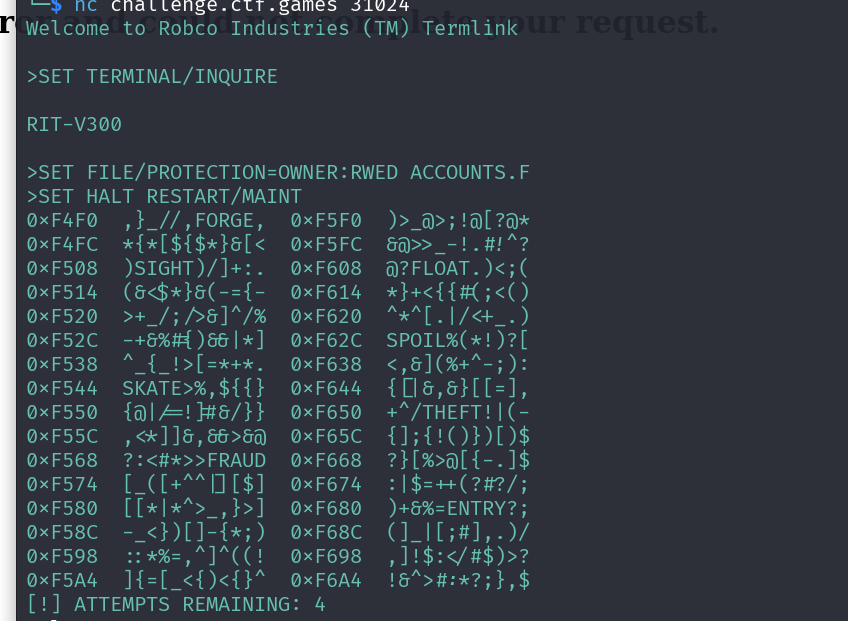
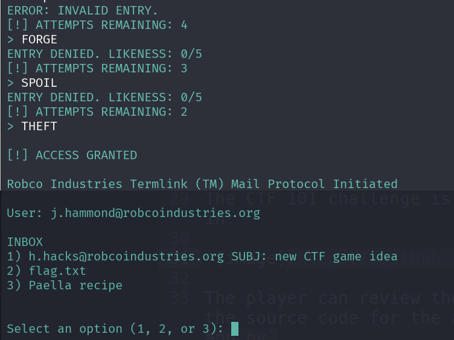
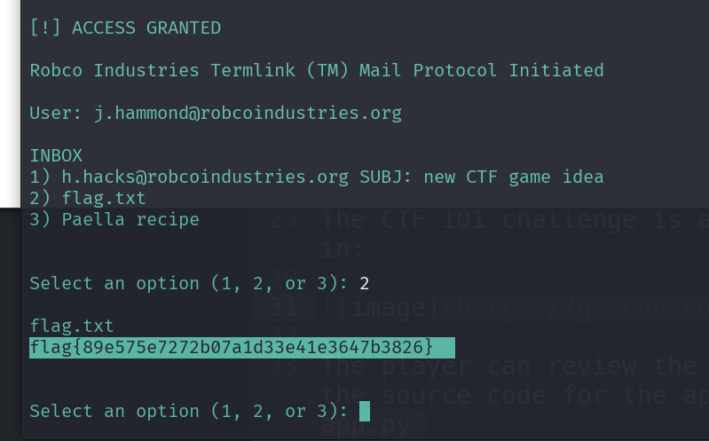

# Science 100

**Description:**

<small>Author: @HuskyHacks</small><br><br>Patrolling the Mojave almost makes you wish for a nuclear winter. <br><br> <b>Press the <code>Start</code> button on the top-right to begin this challenge.</b>


**Category:** Warmups

**Difficulty:** easy

## Solution

After launching the challenge, the screen displayed a terminal prompt resembling an old-school computer interface.


A quick Google search of the phrase **"Welcome to RobCo Industries (TM) Termlink"** revealed that this is a reference to the hacking mini-game from the Fallout series.

Since I hadn’t played Fallout before, I used ChatGPT to provide how this worked:
```
Step 1: Recognizing the Pattern
The text is split into hexadecimal addresses (e.g., 0xF4F0, 0xF5F0), which typically represent memory locations.
Following each hex address is a series of symbols and characters, but among them, some words stand out.
Step 2: Identifying English Words
If you scan the text, you will notice some segments contain actual words among the random symbols.
These words stand out as potential passwords because Fallout-style hacking puzzles embed real words within a block of random characters.
From your provided terminal dump, these words were visible:

bash
Copy
Edit
0xF508  )SIGHT)/]+:.
0xF62C  SPOIL%(*!)?[
0xF544  SKATE>%,${{}
0xF650  +^/THEFT!|(-   
0xF568  ?:<#*>>FRAUD
0xF680  )+&%=ENTRY?;
0xF4F0  ,}_//,FORGE,
0xF608  @?FLOAT.)<;(
```

Using the insight from ChatGPT, I analyzed the words and input a likely candidate into the terminal.


To get the flag of `flag{89e575e7272b07a1d33e41e3647b3826}`



