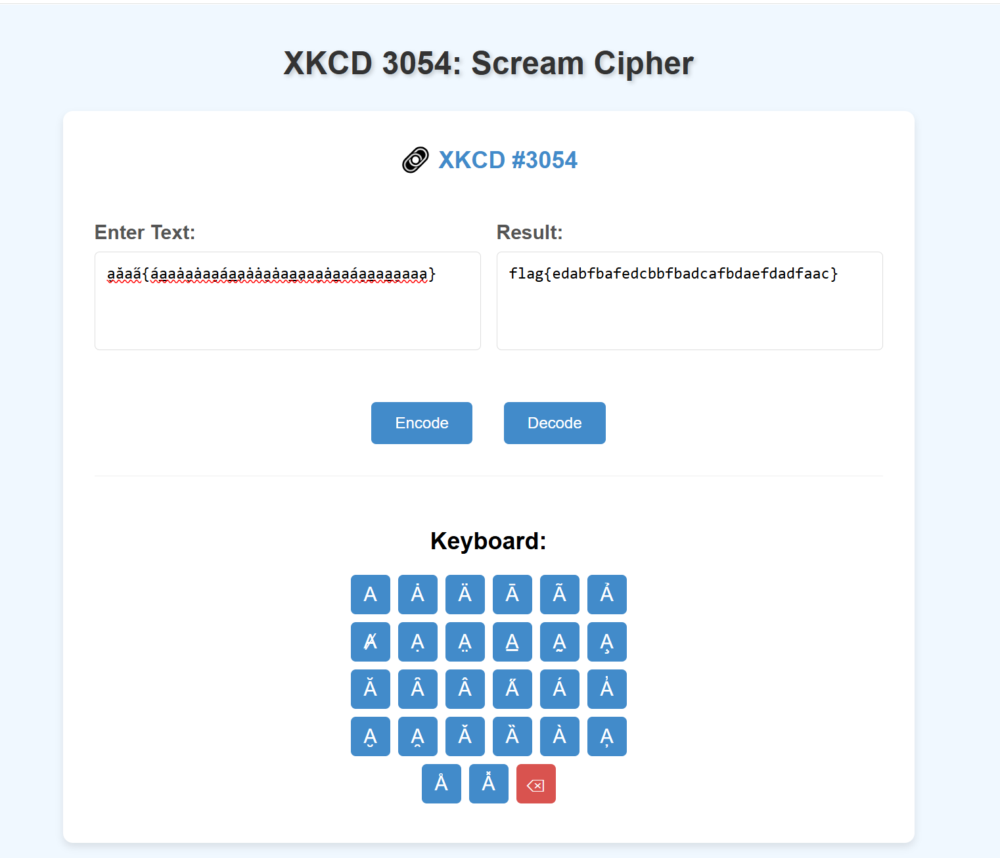

# Screaming Crying Throwing up

**Description:**

<small>Author: @Kkevsterrr</small>  Or some xkcd cipher like that. 

**Category:** Warmups

**Difficulty:** easy

**File:** [screaming.bin](screaming.bin)

## Solution

First, I examined the file using the strings command, but it did not produce any useful output.

Ran the `file` command to determine its type, which identified it as: `Unicode text, UTF-8 text, with no line terminators`

Opening the file in a text editor revealed an unusual string of characters: `a̮ăaa̋{áa̲aȧa̮ȧaa̮áa̲a̧ȧȧa̮ȧaa̲a̧aa̮ȧa̲aáa̮a̲aa̲a̮aaa̧}`

The challenge description hinted at an xkcd-inspired cipher, leading me to discover the Scream Cipher decoder. Using the online tool at: https://reginald-gillespie.github.io/ScreamCipher/

Successfully decoded the flag of `flag{edabfbafedcbbfbadcafbdaefdadfaac}`

