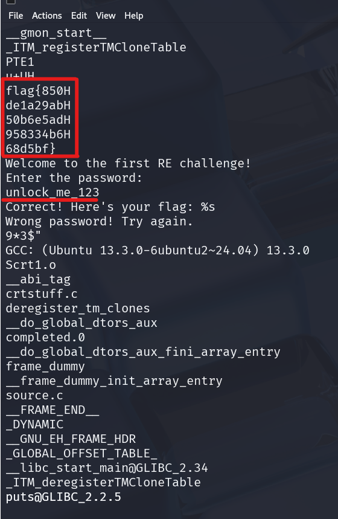
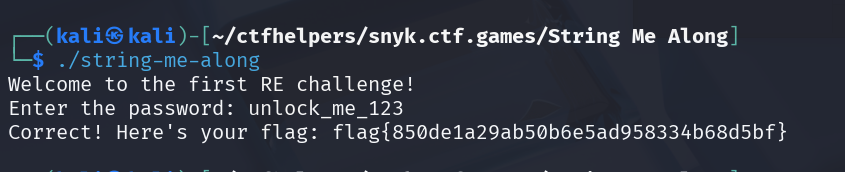

# String Me Along

**Description:**

<small>Author: @Kkevsterrr</small><br><br>String me right along!  <br><br> <b>Download the file(s) below.</b>


**Category:** Reverse Engineering

**Difficulty:** easy

**File:** [string-me-along](string-me-along)

## Solution

Ran the `strings` command on the file:

The output contained what appeared to be a flag but with extra trailing 'H' characters on each line. Additionally, a password prompt was visible in the output.

```
flag{850H
de1a29abH
50b6e5adH
958334b6H
68d5bf}
Welcome to the first RE challenge!
Enter the password: 
unlock_me_123
Correct! Here's your flag: %s
Wrong password! Try again.

```
Running the file and entering `unlock_me_123` provided the flag of `flag{850de1a29ab50b6e5ad958334b68d5bf}`
