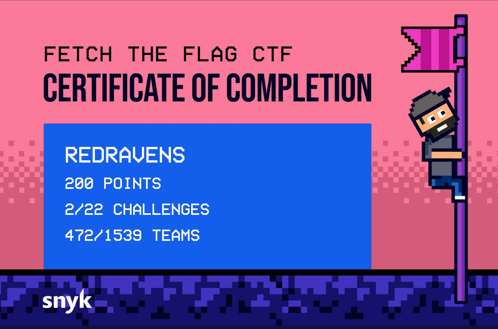

# FETCH THE FLAG 2026

**Organization:** if any

**Starts At:** 2026-02-12 12:00 pm

**Ends At:** 2026-02-13 12:00 pm

## Event Overview
Snyk’s annual Fetch The Flag CTF brought together challenges across Web, AI, Crypto, PWN, Reverse Engineering, and Forensics categories.

Due to time constraints, I wasn’t able to dedicate as much time to this competition as I would have liked. However, with the limited time, I focused on the Web category and successfully solved the Data Vault challenge.

Even though I only completed one challenge, it was a great exercise in identifying and exploiting a classic web vulnerability. I plan to revisit the remaining challenges when time allows to further strengthen my skills.

## Challenges

| Title | Category | Difficulty | Solved | Writeup |
| --- | --- | --- | --- | --- |
| [Data Vault](Web/Data%20Vault/README.md) | Web | easy | :heavy_check_mark: | :heavy_check_mark: |
| [Admin Only Forum](AI/Admin%20Only%20Forum/README.md) | AI | easy |  | |
| [AI WAF](AI/AI%20WAF/README.md) | AI | easy |  | |
| [Backstage Pass](AI/Backstage%20Pass/README.md) | AI | easy |  | |
| [Notely](AI/Notely/README.md) | AI | easy |  | |
| [Vibecoding](AI/Vibecoding/README.md) | AI | easy |  | |
| [Beneath The Curve](Crypto/Beneath%20The%20Curve/README.md) | Crypto | insane |  | |
| [Echo Chamber](Crypto/Echo%20Chamber/README.md) | Crypto | easy |  | |
| [Old Habits](Crypto/Old%20Habits/README.md) | Crypto | easy |  | |
| [Ready - Smile - Action](Crypto/Ready%20-%20Smile%20-%20Action/README.md) | Crypto | medium |  | |
| [Void Step](Forensics/Void%20Step/README.md) | Forensics | easy |  | |
| [Lone Survivor](PWN/Lone%20Survivor/README.md) | PWN | easy |  | |
| [Restrained](PWN/Restrained/README.md) | PWN | medium |  | |
| [Slab Manager](PWN/Slab%20Manager/README.md) | PWN | medium |  | |
| [FuN51llyM4ch1n3](Reverse%20Engineering/FuN51llyM4ch1n3/README.md) | Reverse Engineering | medium |  | |
| [Gen_Z_P'Batching_Game](Reverse%20Engineering/Gen_Z_P-Batching_Game/README.md) | Reverse Engineering | easy |  | |
| [L1c3nC3cH3cK](Reverse%20Engineering/L1c3nC3cH3cK/README.md) | Reverse Engineering | insane |  | |
| [Despicable Me](Web/Despicable%20Me/README.md) | Web | medium |  | |
| [Noteshare](Web/Noteshare/README.md) | Web | medium |  | |
| [Secure Bank](Web/Secure%20Bank/README.md) | Web | insane |  | |
| [Secure MFB](Web/Secure%20MFB/README.md) | Web | insane |  | |
| [The Mission](Web/The%20Mission/README.md) | Web | insane |  | |

Certificate of Completion
