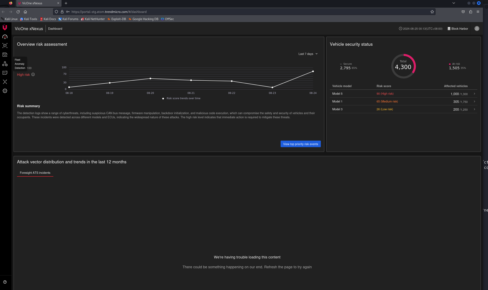
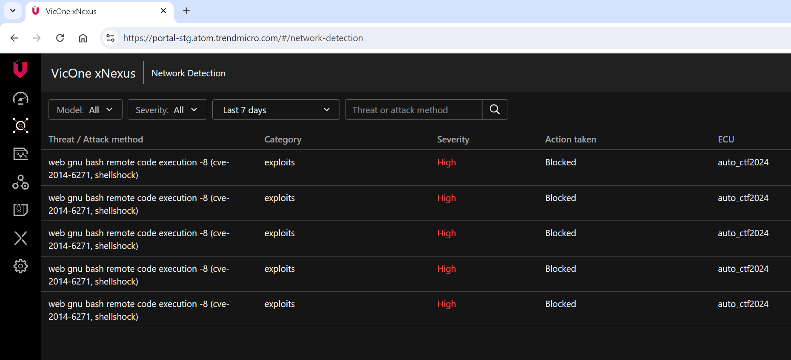

# Web RCE Anomaly

**Description:**

An RCE has been logged in xNexus, what was the exploit used? The answer should be enclosed in the proper flag format of this game.

xNexus account - https://portal-stg.atom.trendmicro.com/#/public/signin
blockharbor_demo@vicone.com
Gkgkzcfuopvhh@@335

Note: Modificiation of the account password will result in immediate disqualification of your ENTIRE team from the CTF. DO NOT MODIFY.

##### **Translated to Japanese:**
xNexusにログとして記録されたRCEは、どういうエクスプロイトが使用されましたか？本ゲームのフラグ形式で答えを囲む必要があります。

xNexusアカウント - https://portal-stg.atom.trendmicro.com/#/public/signin blockharbor_demo@vicone.com Gkgkzcfuopvhh@@335

注意：アカウントパスワードは変更しないでください。変更した場合、失格とさせていただきます。

**Category:** xNexus

## Solution

Logged in to xNexus using the provided credentials.

Explored the portal and observed the logs. 

After investigating the logs, I identified that the exploit used was shellshock.
 

The exploit used for the RCE event in xNexus was Shellshock, which was correctly submitted in the flag format as `bh{shellshock}`.