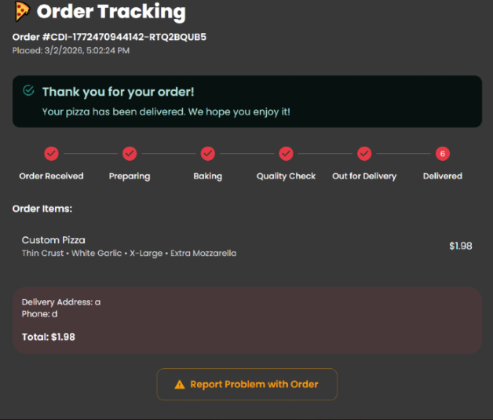
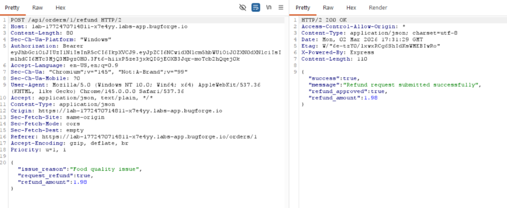
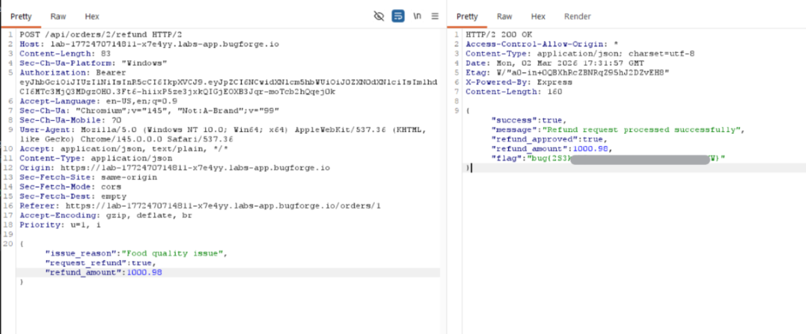

# Chessy Does It 2026-03-02
**Hint:** Broken Logic

## Initial Recon 

While exploring the application, I discovered that it was possible to intercept and modify the order submission request. By tampering with the request, I was able to lower the total price of an order before it was processed.

Although this demonstrated a client-side validation issue, it did not lead to the flag.

## Analyzing Client-Side Logic

Reviewing the JavaScript source revealed client-side role checks that determined whether a user was an `admin` or a basic `user`. I attempted multiple approaches to escalate privileges by manipulating these checks, but all attempts failed with the server correctly enforced authorization.

At this point, it was likely the vulnerability likely involved flawed business logic rather than broken authentication.

## Finding the Real Vulnerability 

After placing a pizza order and waiting for it to be marked as delivered, I noticed a new option appeared on the order page:  

Intercepting this request showed a POST endpoint:  

The critical issue was that the `refund_amount` value was fully controlled by the client.

When submitting the tampered request, the server processed the modified refund amount without validation to get the flag.

## Conclusion

The vulnerability was a broken business logic flaw:
- The server trusted client-supplied refund amounts.
- There was no server-side validation ensuring the refund did not exceed the order total.
- Client-side restrictions can be meaningless without backend enforcement.

