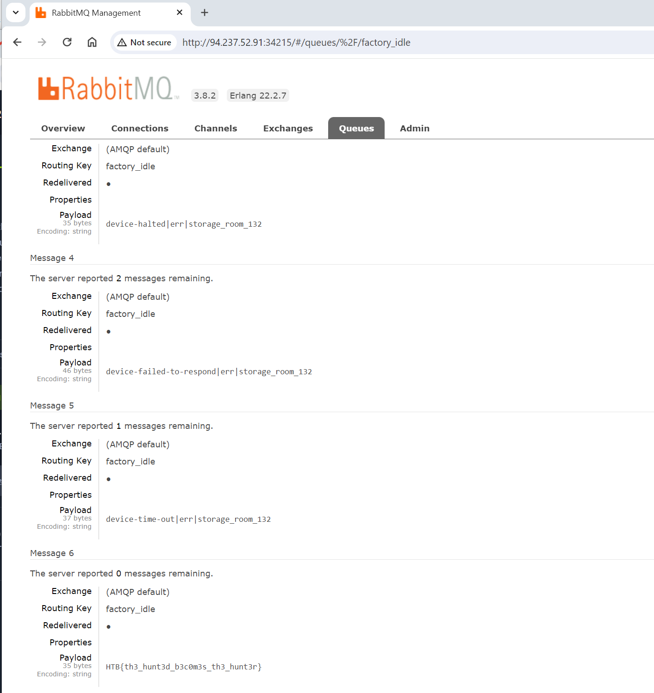

# BunnyPass - Hardward - very easy

As you discovered in the PDF, the production factory of the game is revealed. This factory manufactures all the hardware devices and custom silicon chips (of common components) that The Fray uses to create sensors, drones, and various other items for the games. Upon arriving at the factory, you scan the networks and come across a RabbitMQ instance. It appears that default credentials will work.  

## Solution 

A quick Google search revealed that the default username and password are both `guess`.  

  

After looking around I found the flag in one of the messages `HTB{th3_hunt3d_b3c0m3s_th3_hunt3r}`
