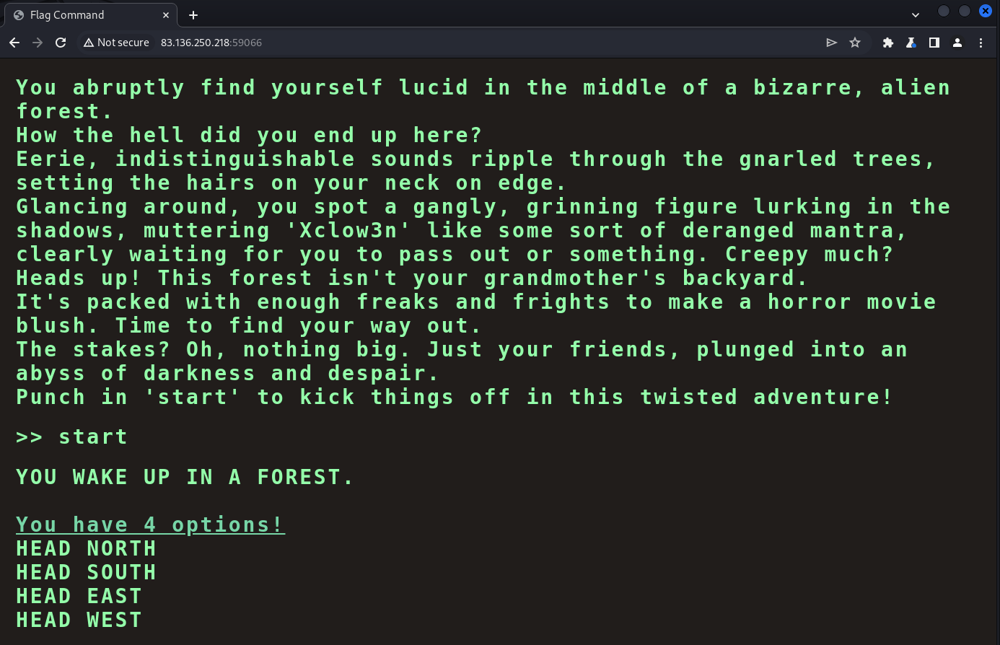
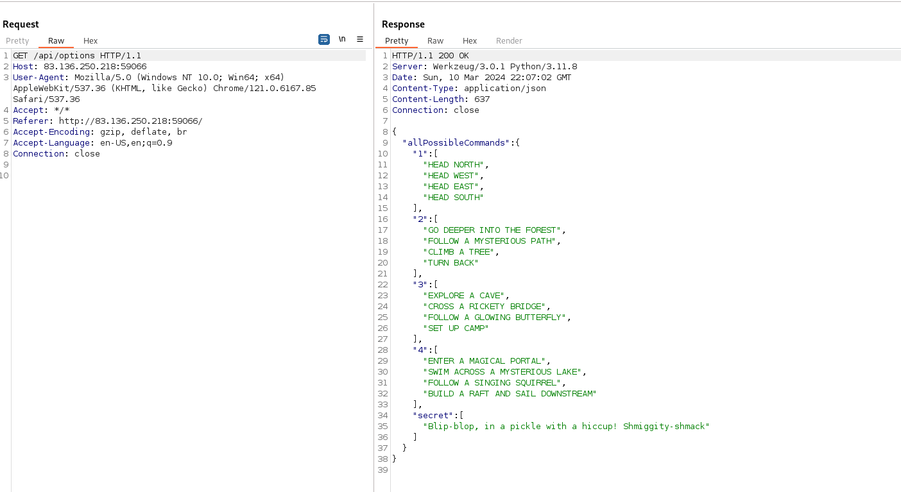
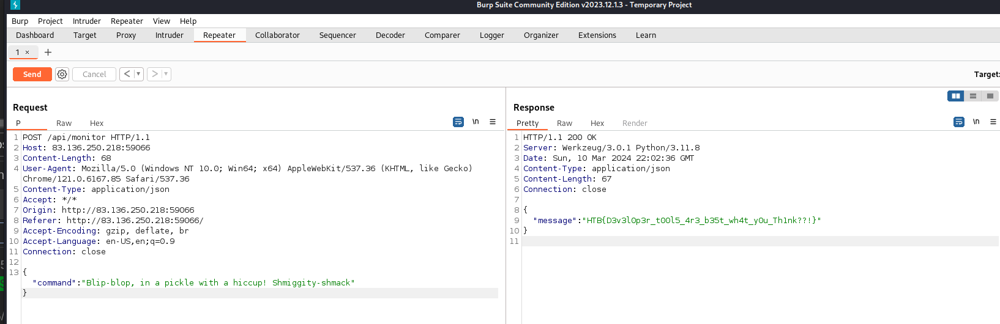

# Flag Command - web - very easy

Embark on the "Dimensional Escape Quest" where you wake up in a mysterious forest maze that's not quite of this world. Navigate singing squirrels, mischievous nymphs, and grumpy wizards in a whimsical labyrinth that may lead to otherworldly surprises. Will you conquer the enchanted maze or find yourself lost in a different dimension of magical challenges? The journey unfolds in this mystical escape!

## Solution 

View the site from a browsers 



Looked over the code and found CheckMessage function and `availableOptions['secret'].includes(currentCommand)` looked intersting.

```javascript
async function CheckMessage() {
    fetchingResponse = true;
    currentCommand = commandHistory[commandHistory.length - 1];

    if (availableOptions[currentStep].includes(currentCommand) || availableOptions['secret'].includes(currentCommand)) {
        await fetch('/api/monitor', {
            method: 'POST',
            headers: {
                'Content-Type': 'application/json'
            },
            body: JSON.stringify({ 'command': currentCommand })
        })
            .then((res) => res.json())
            .then(async (data) => {
                console.log(data)
                await displayLineInTerminal({ text: data.message });

                if(data.message.includes('Game over')) {
                    playerLost();
                    fetchingResponse = false;
                    return;
                }

                if(data.message.includes('HTB{')) {
                    playerWon();
                    fetchingResponse = false;

                    return;
                }

                if (currentCommand == 'HEAD NORTH') {
                    currentStep = '2';
                }
                else if (currentCommand == 'FOLLOW A MYSTERIOUS PATH') {
                    currentStep = '3'
                }
                else if (currentCommand == 'SET UP CAMP') {
                    currentStep = '4'
                }

                let lineBreak = document.createElement("br");


                beforeDiv.parentNode.insertBefore(lineBreak, beforeDiv);
                displayLineInTerminal({ text: '<span class="command">You have 4 options!</span>' })
                displayLinesInTerminal({ lines: availableOptions[currentStep] })
                fetchingResponse = false;
            });


    }
    else {
        displayLineInTerminal({ text: "You do realise its not a park where you can just play around and move around pick from options how are hard it is for you????" });
        fetchingResponse = false;
    }
}
```

Looking at the request to /apt/options where I found the secret message of `Blip-blop, in a pickle with a hiccup! Shmiggity-shmack`.  
  


Took the message to burpsuite repeator with a response containing the flag of `HTB{D3v3l0p3r_t00l5_4r3_b35t_wh4t_y0u_Th1nk??!}`  

